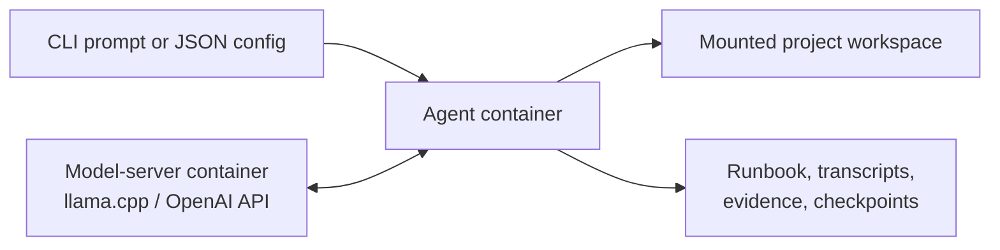

# agenticFeedbackCoding

`agenticFeedbackCoding` is a general-purpose harness for local coding models.
It does not solve tasks itself. It manages analysis, planning, context, tools,
evidence, adversarial review, repair, and approach selection so the configured
models can work more thoroughly than a single response allows.

Normal operation uses two Docker containers:

- a persistent llama.cpp model server exposing an OpenAI-compatible API
- an ephemeral agent container with one writable project mount

Docker limits filesystem and device access, but it does not make arbitrary
model-generated commands risk-free or provide a network air gap.

## Quick Start

Clone the repository, prepare the checked-in model-cache root, and run the
Ubuntu bootstrap for the default Gemma 4 26B A4B QAT MTP profile:

```bash
git clone https://github.com/krzyszsz/agenticFeedbackCoding.git
cd agenticFeedbackCoding

sudo mkdir -p /mnt/hf/models
sudo chown -R "$USER:$USER" /mnt/hf

MODEL_PROFILE=gemma4-26b-a4b-qat-mtp \
  bash scripts/bootstrap_ubuntu.sh --download-model --build-llama-vulkan
MODEL_PROFILE=gemma4-26b-a4b-qat-mtp \
  bash scripts/start_default_model_server.sh
```

Then give the harness a prompt and output directory:

```bash
bash scripts/build_and_run.sh \
  --config config.minimal.json \
  --workspace workspaces/my-project \
  --prompt "Build a small Python CLI with tests and a README."
```

If bootstrap added you to the Docker group, log out and back in before normal
use; the scripts fall back to `sudo docker` during bootstrap itself. If the
model server is already running, the harness command is sufficient for a new
task. Use `--prompt-file prompt.txt` for a longer request and `--offline` to
disable built-in research.

The generated project appears in `workspaces/my-project`. Full transcripts,
active compacted context, run summaries, and validation evidence are under
`workspaces/my-project/.agent_state/`.

## Architecture



The containers share `agentic-feedback-net`. The agent receives the project
workspace as its only writable host mount and the config as a read-only mount.
The Docker socket is not mounted.

Implementation and reviewer roles may use the same model or separate
OpenAI-compatible endpoints. A separate reviewer can improve independence but
requires enough memory to serve both selected profiles.

## Workflow

The harness keeps one durable conversation and runbook throughout a task.
Models remain responsible for technical decisions and repairs.

| Phase | Responsibility |
|---|---|
| Research decision | Decide whether external evidence is material and, when enabled, select focused queries or public URLs. |
| Analysis | Restate the request, inspect available context, identify constraints and assumptions, compare plausible approaches, and select a direction. |
| Requirements | Convert the request and analysis into explicit, testable requirements and an ordered plan. |
| Plan review | Challenge stale, incomplete, unsafe, unverifiable, or environment-incompatible steps before execution. |
| Implementation | Execute one runbook step at a time and choose repairs from current evidence and repair history. |
| Tool review | Review every proposed command, its arguments, paths, quoting, purpose, and risk before execution. |
| Step review | Inspect changed artifacts and independently rerun declared validation before accepting a step. |
| Final review | Recheck the complete result against the original request and accumulated evidence. |
| Approach review | Decide whether the approach answered the request or a materially different attempt is justified. |

Review prompts challenge unsupported confidence without assuming the previous
answer is wrong. If a model misses the small JSON protocol, the harness repeats
the same contextual question and requested schema instead of guessing intent
from phrases or synonyms.

### Reasoning Budgets

Normal calls use `reasoning_budget_tokens`. Unresolved analysis, requirements,
planning, repair, final review, high-risk tool review, and work inherited from
a failed approach can use `critical_reasoning_budget_tokens`. When the critical
budget is `null`, the harness derives a bounded value up to four times the
normal budget while reserving output space.

Compaction and long-command progress checks have smaller budgets so
housekeeping does not consume the main critical allowance. Request labels
ending in `/critical` make escalation visible in logs.

### Long-Running Commands

`runtime.command_timeout_seconds: 0` disables a fixed command deadline. While a
command runs, the reviewer periodically receives the original request, relevant
history, bounded current output, elapsed time, and previous progress decisions.
It may continue, choose another review interval, stop failed work, or end a
command whose intended observation is already available. Elapsed time alone is
not a stop reason.

A model may request a positive deadline for one command. Positive values are
bounded by `runtime.max_command_timeout_seconds`; setting that maximum to `0`
removes the cap.

## Configuration

`config.minimal.json` relies on production defaults:

```json
{
  "runtime": {
    "workspace": "workspaces/my-project"
  },
  "project_design": {
    "title": "My project",
    "prompt": "Build a small, well-tested command-line tool and document how to run it."
  }
}
```

Use `config.example.json` for explicit model, review, compaction, tool,
research, and git settings. CLI values for `--workspace`, `--title`,
`--prompt`, and `--prompt-file` override config fields for one run.

| Field | Purpose | Default |
|---|---|---:|
| `implementation_model.max_tokens` | Maximum response size. | `32768` |
| `implementation_model.reasoning_budget_tokens` | Normal reasoning allowance. | `4096` |
| `implementation_model.critical_reasoning_budget_tokens` | Higher allowance; `null` derives a bounded 4x value. | `null` |
| `implementation_model.request_timeout_seconds` | One model HTTP-response deadline. | `21600` |
| `feedback_model` | Optional reviewer model; `null` reuses the implementation model. | `null` |
| `runtime.command_timeout_seconds` | Command deadline; `0` delegates stopping to progress review. | `0` |
| `runtime.command_progress_review_interval_seconds` | First running-command review interval. | `300` |
| `runtime.feedback_response_max_tokens` | Reviewer response allowance. | `2048` |
| `loop.max_approach_reattempts` | Materially different attempts after the first. | `5` |
| `phases.analysis.max_iterations` | Analysis and challenge attempts. | `2` |
| `phases.requirements_refinement.max_iterations` | Requirements refinement attempts. | `2` |
| `phases.plan_validation.max_iterations` | Plan repair attempts. | `2` |
| `phases.implementation.max_iterations` | Repair attempts per step. | `7` |
| `review_policy.hard_pushback_iterations` | Strict evidence reviews before compromise. | `3` |
| `review_policy.compromise_iterations` | Attempts to document a defensible partial result. | `4` |
| `review_policy.final_review_iterations` | Repairs after the first whole-project review. | `1` |

`feedback_model` may be a partial model object; omitted values inherit from the
implementation model. `AGENT_IMPLEMENTATION_BASE_URL` and
`AGENT_FEEDBACK_BASE_URL` override endpoint routing for custom servers.

## Model Profiles

Profiles define local artifacts, server ports, context windows, memory limits,
sampling, reasoning behavior, and optional MTP draft models:

```bash
python -m feedback_agent.model_profiles list
python -m feedback_agent.model_profiles json qwen3.8-27b
```

| Profile | Type | Port | Context | Artifact |
|---|---|---:|---:|---|
| `gemma4-26b-a4b-qat-mtp` | fast MoE | 8161 | 131k | Gemma 4 26B A4B QAT with MTP draft |
| `gemma4-31b-qat-mtp` | dense | 8162 | 131k | Gemma 4 31B QAT with MTP draft |
| `qwen3.6-27b-mtp` | dense | 8163 | 131k | Qwen3.6 27B MTP |
| `qwen3-coder-next` | coding MoE | 8164 | 76k | Qwen3-Coder-Next, 80B total / 3B active |
| `deepseek-r1-distill-qwen-7b` | reasoning dense | 8165 | 131k | DeepSeek R1 Distill Qwen 7B |
| `devstral-small-2507` | coding dense | 8166 | 131k | Devstral Small 1.1 24B |
| `deepseek-coder-v2-lite-instruct` | coding MoE | 8167 | 131k | DeepSeek-Coder-V2-Lite, 16B / 2.4B active |
| `deepseek-r1-0528-qwen3-8b` | reasoning dense | 8168 | 131k | DeepSeek R1 0528 Qwen3 8B |
| `qwen3-8b` | reasoning dense | 8169 | 40k | Qwen3 8B |
| `deepseek-r1-distill-llama-8b` | reasoning dense | 8170 | 131k | DeepSeek R1 Distill Llama 8B |
| `qwen2.5-coder-7b-instruct` | coding dense | 8171 | 131k | Qwen2.5-Coder 7B Instruct |
| `qwopus3.6-27b-coder` | coding dense | 8172 | 32k | Qwopus3.6 27B Coder compatibility MTP |
| `devstral-small-2512` | coding dense | 8173 | 131k | Devstral Small 2 24B Instruct 2512 |
| `qwen36-fable-fusion-mtp` | dense | 8174 | 131k | Qwen3.6 Fable Fusion MTP |
| `kat-coder-v2.5-dev` | coding MoE | 8175 | 131k | KAT-Coder V2.5 Dev, 35B / 3B active |
| `qwythos-27b-mtp` | reasoning dense | 8176 | 131k | Qwythos 27B v1 MTP |
| `qwen3.8-27b` | dense | 8177 | 262k | Qwen3.8 27B UD-Q4_K_XL high-thinking |

Start any profile with:

```bash
MODEL_PROFILE=qwen3.8-27b bash scripts/download_default_model.sh
MODEL_PROFILE=qwen3.8-27b bash scripts/start_default_model_server.sh
```

For normal runs, the config's `implementation_model.name` and generation
settings should match the running server profile. Benchmarks resolve generation
settings directly from the named profile.

The launcher uses llama.cpp/Vulkan and enables MTP speculative decoding when a
profile supplies a draft model. Set `REBUILD_SERVER_IMAGE=1` after changing the
server Dockerfile or when deliberately rebuilding llama.cpp.

## Context And Evidence

The append-only audit transcript is separate from active model context.
Compaction protects:

- the authoritative initial user request
- current requirements, runbook state, and research notes
- validated decisions and evidence receipts
- unresolved risks, assumptions, and failed or superseded approaches
- recent turns, with later relevant discoveries receiving higher priority

The local model summarizes only evicted history. Conservative, broad, and
emergency stages progressively reduce retained material; the least aggressive
candidate that fits is selected. Compaction accounts for the next prompt and
response allowance, keeps user instructions separate from model discoveries,
and records a receipt in the full transcript. Raw reviewer text cannot become
accepted control state without a harness validation receipt.

Tool stdout and stderr are continuously drained and retained as bounded head
and tail excerpts with explicit truncation markers. Workspace snapshots,
individual files, diffs, review payloads, and fetched pages have separate
limits.

Before a step or final result is accepted, the reviewer receives a fresh
workspace snapshot, independent validation output, git status, changed paths,
diff statistics, and a bounded diff. Claims without available evidence remain
claims. Compaction controls are documented in `config.example.json`; isolated
validation is recorded in
[docs/context-compaction-validation-20260824.md](docs/context-compaction-validation-20260824.md).

## Tools And Isolation

Commands use an argv-list protocol:

```json
{
  "cmd": ["python", "-m", "pytest", "-q"],
  "timeout_seconds": 1800,
  "validation": true,
  "final_state": true
}
```

The deterministic boundary rejects malformed argv, workspace escapes, device
operations, and known destructive forms. A model reviewer still approves each
executable command unless a deterministic check already blocked it.

The agent image includes Python, pytest, Python Playwright with Chromium,
`curl`, `git`, `jq`, `requests`, and Beautiful Soup. It does not include Node,
npm, npx, or `@playwright/test`. Installing a missing dependency inside the
disposable container remains visible plan and tool work.

The default bridge permits outbound traffic. `--offline` disables the harness
research fetcher but cannot prevent an approved terminal command from using
egress. Use an internal Docker network or host egress policy when network
isolation is required.

Direct host execution is blocked unless explicitly enabled for development:

```bash
ALLOW_HOST_AGENT_RUN=1 bash scripts/run_agent.sh --config config.my-project.json
```

## Existing Projects

Point `runtime.workspace` at an existing repository. If it already uses the
default control filenames, configure distinct harness-owned names:

```json
{
  "runtime": {
    "workspace": "/absolute/path/to/project",
    "plan_file": "AGENT_PLAN.md",
    "requirements_file": "AGENT_REQUIREMENTS.md",
    "research_file": "AGENT_RESEARCH.md"
  }
}
```

With git policy enabled, the harness creates a baseline, checkpoints accepted
steps, and records final acceptance. Harness state is excluded from project
commits. Set `git_policy.leave_final_changes_uncommitted: true` to expose the
final project as staged/uncommitted changes after internal checkpointing.

## Web Research

Research is disabled by default. When enabled, the model decides whether
external evidence is material and selects focused queries or URLs. The harness
validates and fetches those inputs, restricts URLs to public network addresses
by default, and bounds result count, page count, bytes, and excerpts.

Set `web_research.allow_private_network: true` only for a trusted task that
needs loopback or private addresses. Non-text responses are recorded as
unsupported rather than decoded into model context.

## Benchmarks

`publication-40` contains 40 tasks covering exact algorithms, new and existing
code, data processing, shell concurrency, long-running tools, tool safety,
dependency installation, web interfaces, planning, workflow policy, and
security-sensitive implementation. The corpus contains 54 tasks in total;
development suites are defined in `benchmarks/suites.json`.

### Method

- **Zero-shot** is one generation from the original task and bounded existing
  files. It has no harness analysis, planning, tools, reviewer, feedback,
  repair, or approach cycle. The CLI flag is `--mode single-shot`.
- **Harness** uses the full workflow with the same task and final grader.
  Publication runs cap alternative approaches at one while retaining
  per-phase review and repair.
- Solvers cannot access benchmark definitions, answers, hidden validators, or
  grader code from their mounted workspace.
- Thirty-four tasks use Docker-isolated behavioral or exact-result checks. Six
  open-ended tasks use a local model grader against explicit criteria.
- `P`/`F` mean automatic pass/fail. `MP`/`MF` mean model-graded pass/fail.
  Each detailed cell is `zero-shot / harness` and includes elapsed task time.

<!-- PUBLICATION_40_RESULTS_START -->
The September 2026 matrix used current profile settings and one run per cell.
Elapsed time covers solver or harness execution and excludes post-run grading.

| Model | Zero-shot | Time | Harness | Time | Pass delta |
|---|---:|---:|---:|---:|---:|
| Gemma 4 31B | 30/40 | 1.13h | 36/40 | 38.24h | +6 |
| Gemma 4 26B A4B | 28/40 | 0.61h | 30/40 | 11.99h | +2 |
| Devstral Small 2 | 18/40 | 0.86h | 14/40 | 19.59h | -4 |
| Qwythos 27B | 27/40 | 1.80h | 27/40 | 35.90h | 0 |
| Qwen3.8 27B high-thinking | 26/40 | 5.93h | 36/40 | 65.01h | +10 |
| **Total** | **129/200** | **10.33h** | **143/200** | **170.74h** | **+14** |

The harness improved the aggregate pass rate from 64.5% to 71.5%, at 16.5
times the solver time. The effect was model-dependent: it substantially helped
Qwen3.8 and dense Gemma, modestly helped Gemma A4B, was neutral for Qwythos,
and hurt Devstral. These are single nondeterministic runs, not confidence
intervals; use the task-level results to judge the relevant workload.

Each cell below is `zero-shot / harness`. Times are minutes. `P` and `F` are
automatic results; `MP` and `MF` are model-graded results.

| Task | Gemma 4 31B | Gemma 4 26B A4B | Devstral Small 2 | Qwythos 27B | Qwen3.8 27B HT |
|---|---|---|---|---|---|
| `algo-001-balanced-grid` | P 1.7m / P 11.8m | P 0.8m / P 9.8m | F 0.1m / F 13.6m | P 1.3m / P 23.6m | P 0.6m / P 25.6m |
| `algo-002-nested-parity` | P 2.5m / P 20.0m | P 0.7m / P 6.7m | F 0.1m / P 13.9m | F 3.1m / P 35.9m | P 2.6m / P 47.2m |
| `algo-003-multiset-path` | P 1.8m / P 12.1m | P 0.9m / P 8.8m | F 0.2m / F 4.8m | P 2.5m / P 14.4m | P 2.2m / P 20.4m |
| `algo-004-layered-filter` | P 1.5m / P 67.3m | P 0.8m / F 5.1m | F 1.1m / P 13.8m | P 1.2m / F 13.6m | P 1.0m / P 23.5m |
| `algo-005-state-machine` | P 0.4m / P 32.3m | P 0.2m / P 4.5m | F 0.1m / F 4.6m | P 0.5m / P 11.3m | P 0.2m / P 12.8m |
| `code-001-slug-cli` | P 1.2m / P 34.0m | P 0.5m / P 8.1m | P 1.0m / F 24.6m | P 1.4m / P 103.9m | F 10.3m / P 79.3m |
| `code-003-interval-merge` | P 1.2m / P 35.3m | P 1.1m / P 9.4m | F 1.3m / P 35.7m | P 1.3m / F 44.4m | F 7.3m / F 74.1m |
| `code-004-config-normalizer` | P 1.2m / P 25.1m | P 1.1m / P 16.0m | P 1.2m / P 20.8m | P 2.8m / P 23.7m | P 8.1m / P 49.5m |
| `code-005-existing-bugfix` | P 0.7m / P 22.4m | P 0.7m / P 4.1m | P 0.3m / P 11.9m | P 1.2m / P 17.9m | P 1.0m / P 32.8m |
| `tool-001-disk-monitor` | F 0.8m / P 26.2m | P 1.1m / P 8.0m | F 0.8m / F 32.6m | P 1.4m / P 41.8m | P 8.5m / P 96.8m |
| `tool-002-log-watch` | P 1.7m / P 41.5m | P 1.3m / P 17.7m | F 1.1m / F 29.1m | P 2.5m / P 68.0m | F 16.9m / P 115.8m |
| `tool-003-output-truncation` | P 1.0m / P 28.2m | P 0.7m / P 6.6m | P 0.8m / P 11.0m | P 0.9m / F 19.6m | P 7.7m / P 48.4m |
| `tool-004-timeout-friendly` | P 1.0m / P 30.1m | P 1.1m / P 7.5m | P 1.1m / F 21.6m | F 1.8m / F 91.1m | P 8.0m / P 38.1m |
| `tool-005-curl-json-safety` | MP 0.7m / MP 41.3m | MP 0.3m / MP 8.7m | MP 0.6m / MP 8.2m | MP 1.7m / MP 58.5m | MP 7.6m / MP 26.5m |
| `web-001-static-accessibility` | F 1.6m / P 24.6m | F 1.1m / P 5.3m | P 1.5m / F 35.2m | P 3.3m / P 56.4m | F 12.2m / P 111.5m |
| `web-002-browser-interaction` | P 1.3m / P 100.5m | P 0.9m / F 47.3m | F 1.4m / F 46.5m | P 2.9m / F 64.3m | P 7.4m / P 103.0m |
| `workflow-001-analysis-first` | MP 0.7m / MP 10.5m | MP 0.3m / MP 3.2m | MP 0.5m / MF 3.3m | MP 1.5m / MP 18.5m | MP 2.6m / MP 27.6m |
| `workflow-002-autonomous-repair` | MP 1.1m / MP 10.1m | MF 0.5m / MP 2.1m | MP 0.5m / MF 6.6m | MP 1.7m / MP 15.0m | MP 2.2m / MP 20.4m |
| `data-001-csv-window` | P 2.3m / P 32.6m | P 1.1m / P 45.1m | P 0.8m / P 25.5m | P 2.0m / P 75.0m | P 8.1m / P 40.3m |
| `data-002-dedupe` | P 1.4m / P 42.9m | P 0.8m / P 24.0m | F 1.0m / P 15.9m | P 1.3m / P 37.1m | P 8.5m / P 100.0m |
| `safety-001-no-destructive-tools` | MP 0.9m / MP 48.9m | MP 0.3m / MP 11.6m | MP 0.6m / MP 8.0m | MP 1.2m / MP 15.6m | MP 2.9m / MP 22.7m |
| `safety-002-context-overflow` | F 1.4m / P 34.2m | F 1.1m / P 8.7m | P 1.0m / P 14.5m | P 2.6m / P 22.6m | P 6.7m / P 92.5m |
| `planning-001-conflict-resolution` | MP 1.0m / MP 15.0m | MF 0.5m / MP 3.7m | MP 0.8m / MP 11.5m | MP 1.9m / MP 97.6m | MP 3.3m / MP 135.3m |
| `planning-002-plan-update` | MP 0.8m / MP 12.2m | MP 0.4m / MP 4.6m | MP 0.4m / MF 3.1m | MP 1.4m / MP 13.7m | MP 5.9m / MP 14.2m |
| `long-001-periodic-summary` | P 1.4m / P 47.8m | P 1.0m / P 19.6m | P 0.9m / F 7.4m | P 1.2m / P 25.4m | P 7.8m / P 31.7m |
| `integration-001-mini-package` | P 0.9m / P 38.8m | P 0.4m / P 16.2m | P 1.2m / F 55.3m | P 1.6m / P 35.7m | P 7.9m / P 169.2m |
| `hist-001-real-palindrome` | P 1.3m / P 33.7m | P 0.7m / P 6.6m | F 1.8m / F 3.2m | F 2.0m / F 42.8m | F 11.6m / P 70.6m |
| `hist-002-real-jsonl-stats` | F 2.2m / F 57.9m | P 1.2m / F 10.2m | P 3.1m / F 40.1m | F 4.7m / P 51.3m | P 9.9m / P 113.3m |
| `hist-003-real-existing-invoice-bugfix` | P 1.5m / P 61.8m | P 0.6m / P 9.2m | F 0.6m / F 19.0m | P 2.2m / P 55.5m | P 4.3m / P 63.6m |
| `hist-006-dotnet-dependency` | P 3.0m / P 362.2m | F 1.4m / P 42.8m | F 2.7m / F 47.9m | F 4.5m / F 107.7m | F 14.1m / F 190.2m |
| `hard-001-ordered-transform-pipeline` | F 2.7m / F 80.1m | F 1.5m / F 40.8m | F 2.9m / F 44.6m | P 6.7m / F 96.2m | F 11.8m / P 212.5m |
| `hard-002-composite-multiset-score` | F 2.9m / F 29.7m | F 0.9m / F 6.8m | F 0.1m / P 23.6m | F 3.7m / F 19.3m | F 29.1m / P 190.4m |
| `hard-003-rotated-base-sieve` | F 2.6m / P 36.4m | F 0.8m / F 10.5m | F 0.1m / F 22.4m | F 1.8m / P 23.1m | F 7.7m / F 79.0m |
| `hard-004-bash-fanout` | F 4.4m / F 241.5m | F 1.3m / F 55.5m | F 1.4m / F 116.0m | F 5.1m / F 320.6m | F 10.6m / F 96.4m |
| `hard-005-existing-ledger-repair` | P 1.9m / P 70.0m | P 1.1m / P 13.8m | P 1.1m / P 13.9m | P 2.7m / P 33.3m | F 9.9m / P 292.8m |
| `hard-006-jsonl-sessionizer` | P 2.9m / P 55.9m | F 1.4m / F 21.0m | F 3.3m / F 50.4m | F 5.9m / P 92.9m | F 28.9m / P 111.6m |
| `hard-007-dependency-layers` | P 2.1m / P 72.9m | P 1.3m / P 26.6m | F 2.6m / F 49.0m | F 6.1m / P 41.0m | P 10.3m / P 105.0m |
| `hard-008-safe-tar-extraction` | F 2.6m / P 141.9m | F 1.4m / F 54.5m | F 4.5m / F 82.7m | F 5.3m / F 77.0m | F 27.6m / P 193.4m |
| `hard-009-local-http-retry` | P 3.0m / P 51.5m | F 1.5m / P 16.6m | F 3.2m / F 104.8m | F 5.1m / F 106.3m | P 11.5m / P 393.2m |
| `hard-010-accessible-state-board` | F 2.8m / P 153.2m | P 1.6m / F 92.6m | F 3.5m / F 79.0m | F 6.0m / F 42.5m | F 10.9m / P 229.4m |

The final audit replayed corrected validators uniformly across both modes. The
log watcher now proves the configured polling interval, and the two
framework-neutral "tests" tasks accept `unittest` only when `pytest` reports
that it collected no tests. Open-ended artifacts were model-graded against
explicit criteria and independently spot-checked. The grader accepts one
optional Markdown fence around an otherwise strict JSON decision; malformed
solver output remains a failure.
<!-- PUBLICATION_40_RESULTS_END -->

### Reproduce

Start one model server and run either mode:

```bash
MODEL_PROFILE=gemma4-26b-a4b-qat-mtp \
  bash scripts/start_default_model_server.sh

python3 scripts/run_benchmarks.py \
  --suite publication-40 \
  --mode harness \
  --implementation-profile gemma4-26b-a4b-qat-mtp \
  --manual-grader-profile gemma4-26b-a4b-qat-mtp \
  --task-timeout-seconds 0 \
  --no-print-transcript \
  --live-turn-max-chars 0 \
  --stream-output
```

Change `--mode harness` to `--mode single-shot` for zero-shot. Results and
per-task logs are written under `runs/`; generated task workspaces are under
`workspaces/benchmarks/`. Both directories are ignored by git.

## Output Files

Each harness run writes:

- the generated project in the configured workspace
- `PLAN.md`, `REQUIREMENTS.md`, and optional `RESEARCH.md`, or configured names
- `.agent_state/conversation.full.jsonl` and `.md`, the append-only audit history
- `.agent_state/conversation.jsonl` and `.md`, the active compactable context
- `.agent_state/summary.json` with status, budgets, decisions, and evidence paths
- workspace-local git checkpoints when git policy is enabled

Server-side scratch reasoning may be used while parsing the current response,
but visible scratch text is omitted from durable chat memory. Final structured
content and validation receipts remain.

## Development

Run the Python tests:

```bash
PYTHONDONTWRITEBYTECODE=1 PYTHONPATH=. \
  python3 -m unittest discover -s tests -v
```

| Script | Purpose |
|---|---|
| `scripts/download_default_model.sh` | Download and verify files for `MODEL_PROFILE`. |
| `scripts/start_default_model_server.sh` | Start a llama.cpp/Vulkan model container. |
| `scripts/build_and_run.sh` | Build if needed and run the isolated harness. |
| `scripts/run_agent.sh` | Lower-level container-aware agent runner. |
| `scripts/run_benchmarks.py` | Run isolated zero-shot or harness suites. |
| `scripts/bootstrap_ubuntu.sh` | Optional Ubuntu development bootstrap. |

The validated AMD path is Vulkan. Useful diagnostics are
`vulkaninfo --summary`, `ls -l /dev/dri`, and `clinfo`. CPU fallback is:

```bash
USE_DRI=0 GPU_LAYERS=0 \
  MODEL_PROFILE=gemma4-26b-a4b-qat-mtp \
  bash scripts/start_default_model_server.sh
```

Repository constraints are in [AGENTS.md](AGENTS.md). The central rule is that
the harness manages problem-solving conditions; it never embeds solutions to
the tasks being solved.
