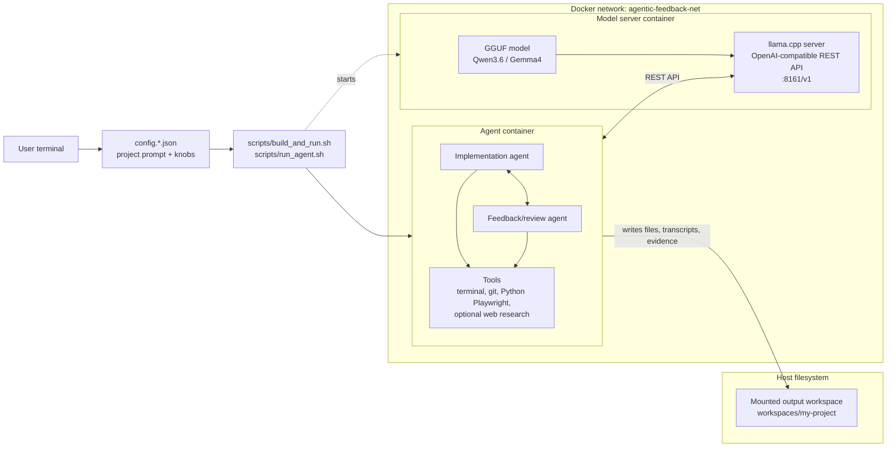

# Intro: the problems to solve

* Quality: When using AI models for coding, or even just for brainstorming, a lot of answers are very vague, not properly checked, not properly developed, as if the AI-model was hoping for you to be fine with low quality work. Solution: automated feedback - the same model can play a role of an auditor that pushes back, forces proper planning and checks the testing evidence.

* Lack of control: You don't want to give the entire machine to a random AI model that can run unpredictable commands in your system. You need to just let it work within a workspace directory that is only visible from a docker container so it does the work for you but only sees what you want it to see. Solution: running a light script that just spins 2 dockers: one serving a model and the other using the model - everything locked up and safe.

# This project

`agenticFeedbackCoding` runs a Docker-isolated local AI coding workflow: edit one JSON prompt, start an OpenAI-compatible model server, and let one agent implement while a second agent reviews every step with tests, git diffs, command output, file evidence, and screenshots/reports when available.

The main tested setup uses `Qwen3.6-27B Q4_K_M` GGUF served by llama.cpp/Vulkan through an OpenAI-compatible endpoint on AMD Ryzen AI Max+ 395 / Strix Halo. A second comparison run used `Gemma4-26B-A4B Q4_K_M` through the same endpoint shape. Other OpenAI-compatible local or remote models can be configured, but the evidence in this README comes from those local GGUF runs. Normal work uses two Docker containers for safety and reproducibility: one model-server container and one agent container on a shared Docker network. Only the generated project workspace is mounted out to the host.

The project is intentionally config-driven. One JSON file defines the model endpoint, workspace, review strictness, allowed tools, web/offline mode, context-safety limits, and the project prompt.

## Architecture

The normal local setup keeps model serving and agent execution in separate
containers. The CLI script starts the workflow from one JSON config, the agent
container talks to the model container through an OpenAI-compatible REST API,
and only the generated workspace is mounted back to the host.



## Quick Start

Clone the repo, start the local model server, then run a real benchmark through Docker:

```bash
# Ubuntu host prerequisites if you do not already have them:
# sudo apt-get update && sudo apt-get install -y git docker.io python3 curl ca-certificates
git clone https://github.com/krzyszsz/agenticFeedbackCoding.git
cd agenticFeedbackCoding
MODEL_ROOT=$HOME/hf/models bash scripts/start_default_model_server.sh
bash scripts/build_and_run.sh --config config.real-palindrome.json
```

That run starts the model server on the `agentic-feedback-net` Docker network, builds the agent container, mounts only the configured workspace, asks the local model to build the project, and stores the full transcript plus review evidence under `workspaces/real-palindrome/.agent_state/`.

The live transcript is printed while the run is active, so a long job should visibly move through requirements, plan review, implementation attempts, and feedback. While a model call is in flight, the terminal also prints a heartbeat with elapsed time and a lightweight REST health check. Those heartbeat lines are human-facing only; they are not written into the reusable agent transcripts under `.agent_state/`. The final terminal output is compact by default; the full evidence is written under `.agent_state/`.

## One Config File

Copy a real config and edit the prompt/workspace:

```bash
cp config.example.json config.my-project.json
```

The important fields are usually enough:

```json
{
  "implementation_model": {
    "base_url": "http://127.0.0.1:8161/v1",
    "model": "local-gguf",
    "context_window": 76800,
    "max_tokens": 32768,
    "temperature": 0.25,
    "request_timeout_seconds": 21600,
    "retry_attempts": 20,
    "retry_sleep_seconds": 30,
    "request_heartbeat_seconds": 30,
    "preserve_reasoning": true
  },
  "feedback_model": null,
  "mcp_tools": {
    "terminal": true,
    "web_scraping": false,
    "web_interaction": true
  },
  "runtime": {
    "docker_isolation": true,
    "docker_user": "host",
    "workspace": "workspaces/my-new-project",
    "plan_file": "PLAN.md",
    "requirements_file": "REQUIREMENTS.md",
    "research_file": "RESEARCH.md",
    "command_timeout_seconds": 120,
    "max_command_timeout_seconds": 21600,
    "color_transcript": true,
    "live_turn_max_chars": 0,
    "final_summary": "compact",
    "feedback_response_max_tokens": 4096
  },
  "web_research": { "enabled": false },
  "project_design": {
    "title": "My new project",
    "prompt": "Build a browser game with tests and documentation."
  }
}
```

For a very small config, start from `config.minimal.json` or override the prompt
and workspace from the command line:

```bash
bash scripts/build_and_run.sh \
  --config config.minimal.json \
  --workspace workspaces/my-project \
  --prompt "Build a small Python CLI with tests and a README."
```

For longer prompts, keep the prompt in the JSON file. The command-line override
is a convenience, not a replacement for versioned task configs.

`command_timeout_seconds` is only the default timeout for one terminal command. It is not the model response timeout. If a generated test or build step needs longer, the agent can request it per command:

```json
{"cmd": ["python", "long_running_check.py"], "timeout_seconds": 7200}
```

That request is clamped by `runtime.max_command_timeout_seconds`. Model calls use `implementation_model.request_timeout_seconds`, which is set high by default for long local-model runs.

`runtime.final_summary` controls only the final stdout block after the live transcript:

- `compact` prints status, step counts, and evidence paths.
- `full` prints the full nested `summary.json` object.
- `none` suppresses the final block.

`runtime.live_turn_max_chars` controls live console output for each transcript turn. The default `0` prints each turn fully as it happens. Set a positive value, for example `30000`, if you want progress to remain visible without a single huge tool payload flooding the terminal. Saved transcript files are not truncated by this setting.

## Safety Model

Normal agentic work runs inside Docker. `scripts/run_agent.sh` refuses to run the workflow directly on the host unless `ALLOW_HOST_AGENT_RUN=1` is explicitly set for harness development.

The standard setup uses two containers on one Docker network:

- `scripts/start_default_model_server.sh` creates/uses `agentic-feedback-net`, starts the llama.cpp/Vulkan server as `agentic-qwen36-server`, and publishes `127.0.0.1:8161` for host-side checks.
- `scripts/run_agent.sh` starts the agent container on the same network and overrides the in-container model URL to `http://agentic-qwen36-server:8161/v1`.

The agent container gets one writable mount: the configured `runtime.workspace`, mapped to `/workspace/project`. The config file is mounted read-only. The Docker socket is not mounted. Host networking is no longer required for the normal two-container path; keep it only as an explicit compatibility mode with `DOCKER_NETWORK=host AGENT_DOCKER_NETWORK=host`.

The agent container includes Python, Python Playwright with a preinstalled Chromium browser, system Chromium, `pytest`, `curl`, `git`, `jq`, `requests`, and `beautifulsoup4`, so generated projects can run tests, browser checks, and scraping-style tasks without installing those tools into the host project folder.

Browser validation is intentionally Python-first by default. The container does not include Node, npm, npx, or `@playwright/test`, so generic browser/UI validation should use `from playwright.sync_api import sync_playwright`. That is a weak preference, not a technology lock: if a task explicitly requires another SDK/runtime, make dependency discovery and container-local installation an explicit plan step, usually with `runtime.docker_user=root`, bounded timeouts, and clear evidence of what was installed.

`runtime.docker_user` defaults to `host`, so generated files are owned by the host user. Set it to `root` only for tasks that intentionally need package-manager access inside the disposable agent container, for example a workflow that checks disk space, installs a small diagnostic tool with `apt-get`, runs it, and writes a report into the mounted workspace. That still does not grant access to the host filesystem outside the configured workspace.

Direct host execution is deliberately awkward:

```bash
ALLOW_HOST_AGENT_RUN=1 bash scripts/run_agent.sh --config config.my-project.json
```

Use that only for harness development. For normal agentic coding, Docker isolation is the supported path.

## Install And Model Setup

If you did not already clone it in Quick Start, clone and enter the repo:

```bash
git clone https://github.com/krzyszsz/agenticFeedbackCoding.git
cd agenticFeedbackCoding
```

The normal Docker-isolated path needs only a small host toolchain: git to clone
the repo, Docker to run the model/agent containers, Python 3 for the wrapper
scripts, and curl for model-server readiness checks.

```bash
sudo apt-get update
sudo apt-get install -y git docker.io python3 curl ca-certificates
sudo usermod -aG docker "$USER"   # log out/in afterwards, or use sudo docker
```

The agent runtime dependencies live inside the agent Docker image. You do not
need to install Playwright, pytest, Python packages, or project-specific SDKs on
the host for normal use.

For the tested Qwen3.6 profile, download the model if needed and build/start
the llama.cpp/Vulkan model-server image:

```bash
HF_TOKEN_FILE=$HOME/hf.key MODEL_ROOT=$HOME/hf/models \
bash scripts/download_default_model.sh

MODEL_ROOT=$HOME/hf/models REBUILD_SERVER_IMAGE=1 \
bash scripts/start_default_model_server.sh
```

`hf.key` is a plain text Hugging Face token outside this repo. Create it only if you need authenticated Hugging Face access:

```bash
printf '%s' 'hf_your_token_here' > "$HOME/hf.key"
chmod 600 "$HOME/hf.key"
```

Default model paths are defined in `scripts/env.sh`:

```bash
HF_ROOT=$HOME/hf
MODEL_ROOT=$HF_ROOT/models
HF_TOKEN_FILE=$HOME/hf.key
```

Start the default llama.cpp/Vulkan server:

```bash
MODEL_ROOT=$HOME/hf/models bash scripts/start_default_model_server.sh
```

By default this starts llama.cpp with `CTX_SIZE=76800`, `PARALLEL=1`,
`MEM_LIMIT=75g`, `MEMORY_SWAP=75g`, `GPU_LAYERS=999`, reasoning enabled,
`REASONING_BUDGET=1024`, `REASONING_FORMAT=deepseek`, and port `8161`.
It also creates/uses the `agentic-feedback-net` Docker network, names the
server container `agentic-qwen36-server`, and publishes the API on the host at
`127.0.0.1:8161` for quick checks.
Override `REASONING_MODE=off`, `REASONING_BUDGET=...`, or
`REASONING_FORMAT=none|deepseek|deepseek-legacy` if a model needs different
thinking behavior.
`PARALLEL=1` keeps one server slot instead of multiplying the long context
across several idle slots. Override these values in the shell if you need a
smaller context, more concurrent slots, or CPU fallback.
Set `REBUILD_SERVER_IMAGE=1` when you want to force a fresh llama.cpp/Vulkan
server image build after changing `docker/llama-cpp-run.sh` or its Dockerfile.
The agent runner similarly reuses `agentic-feedback-coding:local` after the
first build; set `REBUILD_AGENT_IMAGE=1` after changing the harness Dockerfile
or Python code copied into that image.

If you already have a prebuilt agent image, run without rebuilding it:

```bash
docker pull ghcr.io/krzyszsz/agentic-feedback-coding:latest
AGENT_IMAGE=ghcr.io/krzyszsz/agentic-feedback-coding:latest \
SKIP_AGENT_IMAGE_BUILD=1 \
bash scripts/build_and_run.sh --config config.minimal.json --prompt "Build a tiny checked project."
```

Model serving is intentionally separate from the agent image. You can use the
provided llama.cpp/Vulkan container, another machine on your LAN, or any
OpenAI-compatible cloud/local endpoint by setting `implementation_model.base_url`
or `AGENT_IMPLEMENTATION_BASE_URL`.

If you do not want to clone the repo at all, the prebuilt-agent path only needs
a config file and an output directory. The config may be minimal because the
harness has defaults for all other knobs:

```bash
mkdir -p agent-output
cat > config.json <<'JSON'
{
  "runtime": {"workspace": "/workspace/project"},
  "project_design": {
    "title": "Tiny checked project",
    "prompt": "Build a tiny Python CLI with tests and a README."
  }
}
JSON

docker run --rm --network agentic-feedback-net \
  -e AGENT_IMPLEMENTATION_BASE_URL=http://agentic-qwen36-server:8161/v1 \
  -e AGENT_WORKSPACE=/workspace/project \
  -v "$PWD/agent-output:/workspace/project" \
  -v "$PWD/config.json:/app/config.json:ro" \
  ghcr.io/krzyszsz/agentic-feedback-coding:latest --config /app/config.json
```

That simplified path assumes the model endpoint already exists. Setting up the
model server remains hardware-specific, especially for GPU/Vulkan/driver paths.

The checked-in configs keep a host-friendly endpoint:

```text
http://127.0.0.1:8161/v1
```

When the agent itself runs in Docker, `scripts/run_agent.sh` automatically
overrides that URL inside the container to:

```text
http://agentic-qwen36-server:8161/v1
```

Useful networking overrides:

```bash
DOCKER_NETWORK=agentic-feedback-net          # model-server container network
AGENT_DOCKER_NETWORK=agentic-feedback-net    # agent container network
MODEL_SERVER_CONTAINER=agentic-qwen36-server # DNS name used inside the network
MODEL_SERVER_PORT=8161
AGENT_IMPLEMENTATION_BASE_URL=http://my-model:9000/v1
```

Use `DOCKER_NETWORK=host AGENT_DOCKER_NETWORK=host` only if you deliberately
want the older host-network behavior.

## AMD And Driver Notes

The validated local path for this project is Vulkan, not ROCm. On the AMD Ryzen AI Max+ 395 / Strix Halo machine used during development, llama.cpp with Vulkan was more reliable than ROCm for GGUF serving.

Optional AMD/Vulkan host diagnostics use these packages:

```bash
libvulkan1 mesa-vulkan-drivers vulkan-tools clinfo
```

Useful checks:

```bash
vulkaninfo --summary
ls -l /dev/dri
clinfo | head -80
```

If Vulkan causes instability, try CPU fallback for the model server:

```bash
USE_DRI=0 GPU_LAYERS=0 MODEL_ROOT=$HOME/hf/models bash scripts/start_default_model_server.sh
```

That is much slower, but it avoids GPU-driver paths. ROCm is not required and is intentionally not automated here.

## Workflow

The workflow is deliberately more structured than one-pass code generation:

1. Requirements refinement fills gaps in the user prompt, records assumptions, and drafts a plan.
2. Plan validation checks whether the plan is feasible, clear, ordered, and verifiable before implementation starts.
3. Per-step implementation loops run one plan item at a time.
4. Feedback reviews inspect requirements, code, files, command output, reports, screenshots, git diffs, and previous critique before accepting a step.
5. A workspace-local git repository records the accepted baseline and each accepted plan step.
6. A final whole-project review checks the complete result after all individual steps are done.
7. Context compaction preserves durable memory when the transcript approaches the configured context window.

Both agents share one durable chat history. New feedback is appended at the end; previous requirements, implementation attempts, reviews, and correction requests stay visible until compaction is needed.
When compaction does run, the harness pins the current requirements, plan,
research notes, step status, and recent plan notes into the compacted active
context so the agents do not have to rediscover what they are supposed to be
doing.

## Existing Projects

The harness can work on an existing codebase instead of creating a new project from scratch. Point `runtime.workspace` at the project folder and, if the project already has its own `PLAN.md` or `REQUIREMENTS.md`, give the harness separate state filenames:

```json
"runtime": {
  "docker_isolation": true,
  "workspace": "workspaces/existing-bugfix-demo",
  "plan_file": "AGENT_PLAN.md",
  "requirements_file": "AGENT_REQUIREMENTS.md",
  "research_file": "AGENT_RESEARCH.md"
}
```

The checked example seeds a small invoice calculator with a syntax error and a logic bug, then asks the agents to diagnose and repair it without rebuilding the project:

```bash
bash scripts/seed_existing_bugfix_fixture.sh
bash scripts/build_and_run.sh --config config.real-existing-bugfix.json
```

In the verified run, the reviewer first pushed back on vague investigation evidence, then caught that the implementation had fixed only the syntax error while leaving the tax calculation bug. The accepted result fixed both issues, preserved the public API, added `BUGFIX_NOTES.md`, and passed `python -m unittest discover -v`.

## Terminal View

When `runtime.print_transcript=true`, the implementation and feedback turns print live so a long run shows progress instead of going silent. If stdout is a TTY and `runtime.color_transcript=true`, implementation turns use one color and feedback turns another; redirected logs stay plain text.

Long model calls also emit terminal-only heartbeat lines controlled by `implementation_model.request_heartbeat_seconds`, for example:

```text
[model-call] still waiting for qwen3.6-27b-q4km: 30s elapsed; health=ok http=200.
```

The heartbeat probes the model server's OpenAI-compatible `/models` endpoint. It is intentionally not appended to `conversation.jsonl` or `conversation.full.jsonl`, so it cannot pollute later context when a run is resumed or inspected by a model.

## Feedback Review Tools

The feedback agent does not only read the implementation agent's claims. Before each step review, the harness gives the feedback phase its own evidence:

- a fresh snapshot of generated workspace files
- an independent run of the current plan step's `validation_commands`
- return codes, stdout/stderr tails, and timeout flags from those commands
- `git status --short`
- meaningful changed paths, ignoring harness bookkeeping files such as the configured plan/requirements/research documents and `.agent_state/`
- `git diff --stat`
- a truncated `git diff`

The automatic evidence gate uses that feedback-side evidence first. In hard-pushback mode it rejects a step if validation is missing, fails, times out, or if the implementation claims completion without meaningful git changes.

The plan checker also rejects validation commands that would accidentally loop
the agents, such as a raw `python -c "mean([])"` command for an expected
exception path. Expected failures must use `expected_returncode` or a wrapper
assertion that exits 0 only when the intended error occurs.

## Context And Tool Output Resilience

The harness has two separate context-protection layers:

- Conversation compaction runs before model calls and also accounts for the next prompt plus the configured response budget.
- Tool evidence is bounded before it can enter the live transcript. Command stdout/stderr are drained with a bounded tail buffer, workspace file snapshots keep capped excerpts, and git diffs are capped.
- Bounded reviewer evidence remains available in local run summaries, but the feedback pasted back into the next implementation turn uses a compact evidence summary instead of the raw file/output/diff payload.

This matters because a single noisy command, giant generated file, or huge git diff can otherwise overflow the next local-model request even when ordinary chat-history compaction is enabled.

## Git Checkpointing

When `git_policy.enabled=true`, the generated workspace is initialized as a git repository. After requirements and plan validation, the harness creates a baseline commit. Accepted steps are committed only after feedback returns a resolved status. The final whole-project review also creates an acceptance commit.

If you want the final project left as uncommitted changes for manual inspection, set:

```json
"git_policy": {
  "enabled": true,
  "commit_completed_steps": true,
  "require_step_diff": true,
  "leave_final_changes_uncommitted": true,
  "final_reset_mode": "soft"
}
```

With that mode, the harness still uses commits internally during review, then resets to the baseline at the end so the final project appears in git as uncommitted/staged changes.

## Web Research And Offline Mode

Web research is optional. The project can run fully locally/offline if you disable it:

```json
"mcp_tools": {
  "web_scraping": false
},
"web_research": {
  "enabled": false
}
```

When enabled, web research only runs if the prompt explicitly asks to search/research/browse, look up current/latest information, or includes source URLs. The harness then fetches pages, writes the configured research file, appends the research result to the transcript, injects compact research notes into later prompts, and asks the generated project to cite/apply source URLs when sources were actually fetched.

Fetched non-text responses, such as PDFs or binary downloads, are recorded as unsupported text sources instead of being decoded into the model prompt. That keeps web research generic and avoids flooding the context window with binary noise.

## Output Files

Each run creates or updates the configured workspace, usually under `workspaces/`, and writes:

- a workspace-local `.git/` repository with baseline, accepted-step, and final-review commits when `git_policy.enabled=true`
- the configured research file, normally `RESEARCH.md`, when web research was requested and enabled
- the configured requirements file, normally `REQUIREMENTS.md`, with refined requirements and assumptions
- the configured plan file, normally `PLAN.md`, with ordered tasks, acceptance criteria, validation commands, and status
- `.agent_state/conversation.full.jsonl` with the append-only full machine-readable agent chat
- `.agent_state/conversation.full.md` with the append-only transcript in readable Markdown
- `.agent_state/conversation.jsonl` with the active model context, which may be compacted during long runs
- `.agent_state/conversation.md` with the active model context in readable Markdown
- `.agent_state/summary.json` with step results, review statuses, and feedback evidence

When llama.cpp exposes thinking as `reasoning_content`, the client preserves it
in those transcripts by default. Recent thinking stays in active chat context;
older raw thinking is summarized during compaction so long runs keep useful
decisions without filling the context window with every internal token.

Generated workspaces, logs, reports, transcripts, and test evidence are ignored by git. They are useful locally, but they should not be published by accident.

## Configuration Knobs

| Field | Purpose | Typical values |
|---|---|---|
| `implementation_model.name` | Human-readable model profile name. | `qwen3.6-27b-q4km` |
| `implementation_model.base_url` | OpenAI-compatible endpoint used by the implementation agent. The Docker runner can override it with `AGENT_IMPLEMENTATION_BASE_URL`, which is how the agent container reaches the model-server container by DNS. | `http://127.0.0.1:8161/v1` |
| `implementation_model.model` | Model id sent to the endpoint. llama.cpp accepts `local-gguf`. | `local-gguf` |
| `implementation_model.context_window` | Context budget used by compaction logic. The default server script starts llama.cpp with `CTX_SIZE=76800`. | `76800` |
| `implementation_model.max_tokens` | Max response length per model call. This is an upper bound, not a target; prompts ask for structured JSON, not artificially short answers. | `32768` |
| `implementation_model.temperature` | Generation randomness. Lower is usually better for coding. | `0.1` to `0.3` |
| `implementation_model.request_timeout_seconds` | HTTP timeout for one model response. This is separate from terminal command timeouts. | `21600` |
| `implementation_model.retry_attempts` | Model HTTP retry budget for temporary server/network failures. Retry progress is printed to stderr. | `20` |
| `implementation_model.retry_sleep_seconds` | Delay between model HTTP retries. Use `0` only for tests. | `30` |
| `implementation_model.request_heartbeat_seconds` | Prints terminal-only elapsed-time and model REST health lines while a model response is in flight. Set `0` to disable it. | `30` |
| `implementation_model.preserve_reasoning` | Preserves server-provided thinking/reasoning in the chat transcript as a `<think>...</think>` block before final content. Disable only if the extra context makes a model less stable. | `true` |
| `feedback_model` | Optional separate reviewer model. `null` reuses the implementation model. | `null` or another model block |
| `mcp_tools.terminal` | Allows command execution for implementation and reviewer validation. | `true` |
| `mcp_tools.web_scraping` | Allows web research/scraping when a task asks for it. | `true` or `false` |
| `mcp_tools.web_interaction` | Adds browser-validation guidance and reviewer expectations. The tested container path is Python Playwright with preinstalled Chromium. | `true` or `false` |
| `runtime.docker_isolation` | Runs generated project work in a container. Normal use should keep this true. | `true` |
| `runtime.docker_image` | Agent container image tag. | `agentic-feedback-coding:local` |
| `runtime.docker_user` | User used inside the agent container. `host` maps to the host UID/GID; `root` is useful only for deliberate container-local package installs. | `host`, `root` |
| `runtime.workspace` | Host-visible output folder for generated project files. | `workspaces/my-task` |
| `runtime.plan_file` | Harness-owned plan filename inside the workspace. Use a custom name when editing an existing repo that already has `PLAN.md`. | `PLAN.md`, `AGENT_PLAN.md` |
| `runtime.requirements_file` | Harness-owned requirements filename inside the workspace. | `REQUIREMENTS.md`, `AGENT_REQUIREMENTS.md` |
| `runtime.research_file` | Harness-owned research filename inside the workspace. | `RESEARCH.md`, `AGENT_RESEARCH.md` |
| `runtime.command_timeout_seconds` | Default timeout for one terminal command. Commands can override it with `{"cmd": [...], "timeout_seconds": N}`. | `60` to `300` |
| `runtime.max_command_timeout_seconds` | Maximum accepted per-command override. Prevents accidental unbounded terminal commands. | `3600` to `21600` |
| `runtime.print_transcript` | Prints the live agent conversation. | `true` for debugging |
| `runtime.color_transcript` | Uses ANSI colors for live transcript roles when stdout is a terminal. Redirected logs stay plain text. | `true` |
| `runtime.live_turn_max_chars` | Optional per-turn cap for live terminal printing only. Saved full transcripts remain append-only and untruncated. | `0` for unlimited, or `30000` |
| `runtime.final_summary` | Final stdout summary mode after the live transcript. Full evidence is always written to `.agent_state/summary.json`. | `compact`, `full`, `none` |
| `runtime.feedback_response_max_tokens` | Separate reviewer output cap. Keep this lower than implementation `max_tokens` because feedback should be structured review JSON rather than generated project content. Set `0` to use the model's full ceiling. | `4096` |
| `context_compaction.enabled` | Enables transcript compaction near context limits. | `true` |
| `context_compaction.threshold_ratio` | Trigger compaction at this fraction of context. | `0.8` |
| `context_compaction.keep_recent_turns` | Recent turns kept verbatim during compaction. | `6` to `12` |
| `context_compaction.tool_output_max_chars` | Max stdout/stderr tail kept from each terminal command. The process is drained continuously so verbose tools cannot flood memory/context. | `4000` |
| `context_compaction.workspace_file_max_bytes` | Max bytes read per workspace file for reviewer evidence. Larger files are represented by first/last excerpts plus size metadata. | `20000` |
| `context_compaction.git_diff_max_chars` | Max git diff text retained for reviewer evidence. | `20000` |
| `context_compaction.transcript_review_max_chars` | Max compact review payload pasted back into the live implementation chat. | `24000` |
| `phases.requirements_refinement.max_iterations` | Requirement refinement retry budget. | `2` |
| `phases.plan_validation.max_iterations` | Plan validation retry budget. | `2` |
| `phases.implementation.max_iterations` | Per-step implementation retry budget. | `7` |
| `review_policy.hard_pushback_iterations` | Strict review attempts before compromise. | `3` |
| `review_policy.compromise_iterations` | Bounded compromise attempts after strict review. | `4` |
| `review_policy.final_review_iterations` | Whole-project review attempts. | `1` or `2` |
| `quality_policy.assume_code_quality_when_unspecified` | Adds default structure/tests/docs requirement unless prompt overrides it. | `true` |
| `quality_policy.require_research_and_structure_step` | Requires a first research/architecture step. | `true` |
| `web_research.enabled` | Enables harness-owned web research before requirements refinement. | `true` or `false` |
| `git_policy.enabled` | Initializes a workspace-local git repository and records git evidence. | `true` |
| `git_policy.commit_completed_steps` | Commits each accepted plan step after feedback resolves it. | `true` |
| `git_policy.require_step_diff` | Rejects step acceptance when there are no meaningful implementation changes to review. | `true` |
| `project_design.title` | Short task title. | Any string |
| `project_design.prompt` | Actual task prompt. | Detailed project brief |

## Real Example Configs

These configs are intended to run against a real local model endpoint. The table below records the latest successful evidence runs and keeps a few reusable stress configs for future checks.

- `config.example.json` - starter task tracker project.
- `config.minimal.json` - tiny override-only config showing that defaults fill in the rest.
- `config.real-palindrome.json` - verified CLI benchmark used as the current evidence run.
- `config.real-arithmetic.json` - focused arithmetic package task, useful for quick prompt/regression checks.
- `config.real-website.json` - static website plus browser interaction task.
- `config.gemma4-palindrome.json` - same CLI benchmark using Gemma4-26B-A4B.
- `config.gemma4-website.json` - same static website/browser benchmark using Gemma4-26B-A4B and a bounded live transcript.
- `config.real-existing-bugfix.json` - existing-project repair benchmark using separate agent-owned state files.
- `config.real-dotnet-dependency.json` - dependency-discovery benchmark where the agent installs .NET inside the disposable container without changing this harness Dockerfile.
- `config.real-jsonl-stats.json` - Qwen JSONL statistics stress benchmark; the latest long run timed out and is kept as a reusable hard case, not as successful evidence.
- `config.gemma4-jsonl-stats.json` - fresh JSONL statistics CLI benchmark using Gemma4-26B-A4B.
- `config.real-interest-rate-research.json` - web-research analysis benchmark using Gemma4-26B-A4B.
- `config.real-city-research.json` - web-research manifest task.
- `config.real-platformer.json` - browser platformer task with Playwright validation requirements.
- `config.gpx-editor.json` - GPX editor task with browser/map-style interaction requirements.

## Scripts

| Script | Purpose |
|---|---|
| `scripts/bootstrap_ubuntu.sh` | Optional convenience bootstrap for local development. The Quick Start shows the minimal host packages explicitly so users can see what is installed. |
| `scripts/install_ubuntu.sh` | Compatibility wrapper around `scripts/bootstrap_ubuntu.sh`. |
| `scripts/download_default_model.sh` | Downloads and verifies the default Qwen3.6 GGUF model and mmproj files. |
| `scripts/start_default_model_server.sh` | Builds if needed and starts the default llama.cpp/Vulkan model server on `agentic-feedback-net`, with host port `8161` published for checks. |
| `scripts/build_and_run.sh` | Convenience wrapper to build/run the agent harness from a config. |
| `scripts/run_agent.sh` | Lower-level runner that re-enters Docker when `runtime.docker_isolation=true` and joins the agent container to the model-server network. |
| `scripts/seed_existing_bugfix_fixture.sh` | Creates the existing-project repair fixture with planted syntax and logic bugs. |
| `scripts/env.sh` | Shared path/model defaults. Override values in the shell. |

## Verified Real Runs

The table below keeps successful real Docker-isolated workload evidence. The newer Qwen runs were deliberately varied so the harness does not become over-fitted to one task shape: a dependency-heavy .NET task, an existing-project bug fix, and a focused Python package task. The prompts keep browser work friendly to Python Playwright because that is preinstalled in the agent container, but dependency installation remains a normal plan step when the project asks for a different stack.

The Qwen server used the default script and port:

```bash
HF_ROOT=/mnt/hf MODEL_ROOT=/mnt/hf/models bash scripts/start_default_model_server.sh
bash scripts/build_and_run.sh --config config.real-palindrome.json
bash scripts/build_and_run.sh --config config.real-website.json
```

The Gemma comparison used the same llama.cpp/Vulkan server wrapper with model overrides:

```bash
HF_ROOT=/mnt/hf MODEL_ROOT=/mnt/hf/models \
MODEL_PATH=/mnt/hf/models/gemma4-26b-a4b-it-gguf/gemma-4-26B-A4B-it-Q4_K_M.gguf \
MMPROJ_PATH=/mnt/hf/models/gemma4-26b-a4b-it-gguf/mmproj-gemma-4-26B-A4B-it-f16.gguf \
CONTAINER=agentic-gemma4-server PORT=8161 CTX_SIZE=76800 \
bash scripts/start_default_model_server.sh

bash scripts/build_and_run.sh --config config.gemma4-palindrome.json
bash scripts/build_and_run.sh --config config.gemma4-website.json
```

The model server was configured for `CTX_SIZE=76800`, `PARALLEL=1`, and the configs used `max_tokens=32768` as a response ceiling. The local models usually returned shorter structured JSON than the ceiling because the task contracts are parseable JSON schemas, but the prompts do not ask the implementation agent to be brief when the work needs more detail.

| Model | Workload | Config | Result | Time | Step attempts | Notes |
|---|---|---|---|---:|---|---|
| Qwen3.6-27B Q4_K_M | Palindrome CLI with unit tests and docs | `config.real-palindrome.json` | resolved | 3,615s | S1=2, S2=1, S3=2, S4=3 | Slower, but disciplined. The reviewer caught a case-sensitive validation mismatch, ambiguous empty-string CLI output, and a too-shallow documentation validator before accepting the corrected project. |
| Qwen3.6-27B Q4_K_M | Three-page website with JS interaction and Playwright validation | `config.real-website.json` | resolved | 4,889s | S1=3, S2=3, S3=1, S4=2 | Most robust complex run. The reviewer rejected shallow validation and required browser/runtime evidence before final acceptance. |
| Qwen3.6-27B Q4_K_M | .NET todo analyzer with container-local SDK install | `config.real-dotnet-dependency.json` | resolved | 6,321s | S1=2, S2=2, S3=4, S4=1, S5=1 | Confirmed the harness can follow a non-Python stack request without changing its Dockerfile. The agent installed .NET SDK 8.0.420 under `/tmp/.dotnet`, installed ICU in the disposable container, built the solution, ran 15 tests, and showed CLI output for overdue tasks. |
| Qwen3.6-27B Q4_K_M | Existing invoice project bug fix | `config.real-existing-bugfix.json` | resolved | 1,998s | S1=2, S2=1, S3=1, S4=1 | Confirmed the harness can repair an existing project instead of starting from a blank directory. The reviewer forced concrete failure reproduction, separated syntax and tax-logic fixes, then accepted after `unittest` passed and `BUGFIX_NOTES.md` documented the repair. |
| Qwen3.6-27B Q4_K_M | Focused arithmetic module with tests and docs | `config.real-arithmetic.json` | resolved | 3,840s | S1=1, S2=3, S3=1, S4=1, S5=2 | Good compact regression run. The reviewer rejected shallow import-only evidence, caught an invalid inline `python -c` validation shape, and accepted only after generated validation scripts and 20 unit tests passed. |
| Gemma4-26B-A4B Q4_K_M | Palindrome CLI with unit tests and docs | `config.gemma4-palindrome.json` | resolved | 195s | S1=1, S2=1, S3=1 | Much faster on the small task and completed without reviewer rework. |
| Gemma4-26B-A4B Q4_K_M | Three-page website with JS interaction and Python Playwright validation | `config.gemma4-website.json` | resolved | 715s | S1=1, S2=3, S3=3 | Fast overall, but more incremental. The reviewer caught incomplete website files, then forced working Python Playwright validation with dynamic port handling before final acceptance. |
| Gemma4-26B-A4B Q4_K_M | JSONL statistics CLI from scratch | `config.gemma4-jsonl-stats.json` | resolved | 974s | S1=4, S2=4, S3=1, S4=1 | Confirmed a fresh project run after the recent harness changes. The reviewer caught missing tests, syntax/runtime errors, missing sample data, and insufficient final evidence. |

One Qwen JSONL statistics stress run using `config.real-jsonl-stats.json` was intentionally not counted above: it timed out after 7,200s while still in the feedback loop. That run was still useful because it exposed a generic issue with stale early artifacts and overly clever one-line Python validation commands; both are now covered by deterministic tests.

Latest generic-regression retest:

| Model | Workload | Config | Result | Time | Step attempts | Notes |
|---|---|---|---|---:|---|---|
| Qwen3.6-27B Q4_K_M | Minimal Python CLI from prompt override | `config.minimal.json` + CLI prompt/workspace override | resolved | 5,445s | S1=1, S2=1, S3=1, S4=2 | Confirmed the minimal config/default merge path still works. Final review ended with a labelled compromise note rather than hidden evidence gaps. |
| Qwen3.6-27B Q4_K_M | Existing invoice project bug fix | `config.real-existing-bugfix.json` | resolved | 3,539s | S1=2, S2=2, S3=1, S4=1 | Confirmed existing-project repair still works with agent-owned state files separated from project files. |
| Gemma4-26B-A4B Q4_K_M | Palindrome CLI with unit tests and docs | `config.gemma4-palindrome.json` | resolved | 889s | S1=3, S2=1, S3=2, S4=1 | Slower than the earlier Gemma run after relaxed prompts and thinking preservation, but the reviewer forced clearer plan and CLI evidence. |
| Gemma4-26B-A4B Q4_K_M | Three-page website with Python Playwright validation | `config.gemma4-website.json` | resolved | 837s | S1=1, S2=1, S3=2, S4=1 | Confirmed complex browser validation still works inside the agent container. |
| Gemma4-26B-A4B Q4_K_M | Web-researched interest-rate impact package | `config.real-interest-rate-research.json` | resolved | 672s | S1=1, S2=1, S3=2, S4=1 | Confirmed the web-research path stays generic. This run exposed and then verified fixes for malformed `grep -m` validation commands and binary/PDF research payload handling. |

Observed Qwen simple workload result:

- The run entered Docker via `scripts/run_agent.sh` because `runtime.docker_isolation=true`.
- The generated project was written to `workspaces/real-palindrome` through the `/workspace/project` mount.
- Feedback-side validation independently ran the generated unit tests and CLI checks, including positive and negative examples.
- The latest rerun passed 18 generated `unittest` cases plus CLI subprocess checks covering core palindrome behavior, case-insensitivity, punctuation handling, non-palindromes, empty strings, Unicode, and command-line integration.
- Workspace git recorded a baseline commit, one accepted commit per completed plan step, and a final review commit.

Observed Qwen complex workload result:

- The run entered Docker via the same isolated `/workspace/project` mount and wrote `workspaces/real-website`.
- Requirements and plan review rejected shallow planning until the steps were independently verifiable.
- The model created a static website, JavaScript interaction, README/notes, and a Playwright validation script.
- Feedback required runtime proof that navigation and the JavaScript interaction worked, not only file-existence checks.
- The accepted project produced browser evidence under the generated workspace, including `out/results.json` and screenshots.

Observed model behavior from these runs:

- Gemma4 was dramatically faster on these two runs, especially the simple CLI task.
- It handled the simple CLI workload cleanly.
- On browser work it needed more explicit environmental guidance and more feedback. In the latest rerun, it first produced incomplete website/browser validation, then the reviewer forced concrete Playwright evidence and a dynamic-port validation script before final acceptance.
- On the existing-project repair run, configurable state filenames kept the fixture's own files separate from the harness plan/requirements documents. Qwen repaired syntax and logic bugs only after the reviewer forced concrete failure evidence.
- On the Gemma JSONL CLI run, the feedback loop did useful work: it caught broken generated code and missing validation evidence before accepting the project.
- On the .NET run, Qwen followed an explicit non-Python technology request and treated dependency setup as project work inside the disposable agent container. That is the intended behavior: Python Playwright is a convenience for browser validation, not a harness-wide technology requirement.
- On the focused arithmetic run, Qwen was slower than Gemma but the feedback loop stayed useful: it pushed for behavioral evidence instead of superficial imports and recovered from invalid validation-command syntax.
- This is not a universal model ranking. It only says that in this harness and with these prompts, Qwen behaved more conservatively on complex coding, while Gemma was much faster and good enough when the tool environment was described tightly.

The evidence is stored locally in ignored generated workspaces:

```text
workspaces/real-palindrome/.agent_state/summary.json
workspaces/real-palindrome/.agent_state/conversation.full.md
workspaces/real-website/.agent_state/summary.json
workspaces/real-website/.agent_state/conversation.full.md
workspaces/gemma4-palindrome/.agent_state/summary.json
workspaces/gemma4-palindrome/.agent_state/conversation.full.md
workspaces/gemma4-website/.agent_state/summary.json
workspaces/gemma4-website/.agent_state/conversation.full.md
workspaces/existing-bugfix-demo/.agent_state/summary.json
workspaces/existing-bugfix-demo/.agent_state/conversation.full.md
workspaces/real-dotnet-dependency/.agent_state/summary.json
workspaces/real-dotnet-dependency/.agent_state/conversation.full.md
workspaces/real-arithmetic/.agent_state/summary.json
workspaces/real-arithmetic/.agent_state/conversation.full.md
workspaces/gemma4-jsonl-stats/.agent_state/summary.json
workspaces/gemma4-jsonl-stats/.agent_state/conversation.full.md
workspaces/real-interest-rate-research/.agent_state/summary.json
workspaces/real-interest-rate-research/.agent_state/conversation.full.md
```

## Tests

Run the harness unit tests without Docker:

```bash
PYTHONDONTWRITEBYTECODE=1 PYTHONPATH=. python3 -m unittest discover -s tests -v
```

Run a real Docker-isolated benchmark. The first command starts the model server
in its own container, and the second command starts the agent container on the
same Docker network:

```bash
MODEL_ROOT=$HOME/hf/models bash scripts/start_default_model_server.sh
bash scripts/build_and_run.sh --config config.real-palindrome.json
```

If your model cache lives outside `$HOME/hf`, override both roots:

```bash
HF_ROOT=/mnt/hf MODEL_ROOT=/mnt/hf/models bash scripts/start_default_model_server.sh
```
