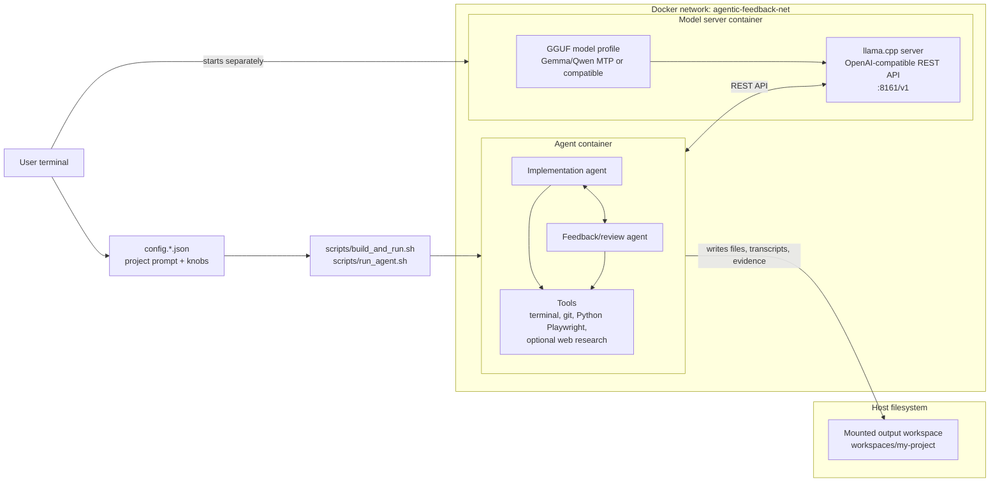

# agenticFeedbackCoding

`agenticFeedbackCoding` runs a Docker-isolated local AI coding workflow. An
implementation agent analyzes and executes a request while a feedback agent
reviews plans, tool calls, evidence, repairs, and the final result.

The project addresses two practical problems: weak model answers receive
automatic evidence-based pushback, and generated commands run in a separate
agent container with one writable project mount. Docker reduces the blast
radius; it does not make arbitrary model-generated work risk-free.

The default local profile is `Gemma 4 26B A4B QAT MTP`, served by
llama.cpp/Vulkan through an OpenAI-compatible endpoint on AMD Ryzen AI Max+ 395
/ Strix Halo. Checked-in profiles also cover Gemma 4 31B QAT MTP, Qwen3.6 27B
MTP, Qwen3-Coder-Next, and DeepSeek R1 Distill Qwen 7B. Other compatible local
or remote models can be configured. Normal work uses two Docker containers for
isolation and reproducibility: one model-server container and one agent
container on a shared Docker network. The generated project workspace is the
agent's only writable host mount; its config is mounted read-only.

The project is intentionally config-driven. One JSON file defines the model endpoint, workspace, review strictness, allowed tools, web/offline mode, context-safety limits, and the project prompt.

## Architecture

The normal local setup keeps model serving and agent execution in separate
containers. The CLI script starts the workflow from one JSON config, the agent
container talks to the model container through an OpenAI-compatible REST API,
and only the generated workspace is mounted back to the host.



## Quick Start

Clone the repo, start the local model server, then give the harness a short
command-line prompt:

```bash
# Ubuntu host prerequisites if you do not already have them:
# sudo apt-get update && sudo apt-get install -y git docker.io python3 curl ca-certificates
git clone https://github.com/krzyszsz/agenticFeedbackCoding.git
cd agenticFeedbackCoding
MODEL_PROFILE=gemma4-26b-a4b-qat-mtp bash scripts/start_default_model_server.sh

bash scripts/build_and_run.sh \
  --config config.minimal.json \
  --workspace workspaces/my-project \
  --prompt "Build a small Python CLI with tests and a README."
```

If the model server is already running, only the second command is needed.
`--workspace` selects the host-visible output folder and `--prompt` replaces the
prompt from the config for that run. Use `--prompt-file prompt.txt` for a longer
brief. For known local profiles, the agent runner infers the model container and
port from the config; explicit endpoint environment variables still take
priority.

That run uses the standard two-container path: the model server runs on the
`agentic-feedback-net` Docker network, the agent container mounts only the
configured workspace, and the full transcript plus review evidence is written
under `workspaces/my-project/.agent_state/`.

For a checked benchmark instead of an ad hoc prompt, run:

```bash
bash scripts/build_and_run.sh --config config.real-palindrome.json
```

The live transcript is printed while the run is active, so a long job should visibly move through requirements, plan review, implementation attempts, and feedback. While a model call is in flight, the terminal also prints a heartbeat with elapsed time and a lightweight REST health check. Those heartbeat lines are human-facing only; they are not written into the reusable agent transcripts under `.agent_state/`. The final terminal output is compact by default; the full evidence is written under `.agent_state/`.

## One Config File

Copy a real config and edit the prompt/workspace:

```bash
cp config.example.json config.my-project.json
```

The important fields are usually enough:

```json
{
  "implementation_model": {
    "name": "gemma4-26b-a4b-qat-mtp",
    "base_url": "http://127.0.0.1:8161/v1",
    "model": "local-gguf",
    "context_window": 131072,
    "max_tokens": 32768,
    "temperature": 0.25,
    "request_timeout_seconds": 21600,
    "retry_attempts": 20,
    "retry_sleep_seconds": 30,
    "request_heartbeat_seconds": 30,
    "preserve_reasoning": true,
    "reasoning_budget_tokens": 4096,
    "critical_reasoning_budget_tokens": null,
    "send_reasoning_budget": true
  },
  "feedback_model": null,
  "mcp_tools": {
    "terminal": true,
    "web_scraping": false,
    "web_interaction": true
  },
  "runtime": {
    "docker_isolation": true,
    "docker_user": "host",
    "workspace": "workspaces/my-new-project",
    "plan_file": "PLAN.md",
    "requirements_file": "REQUIREMENTS.md",
    "research_file": "RESEARCH.md",
    "command_timeout_seconds": 0,
    "max_command_timeout_seconds": 21600,
    "command_progress_review_interval_seconds": 300,
    "command_progress_review_min_interval_seconds": 30,
    "command_progress_review_max_interval_seconds": 3600,
    "color_transcript": true,
    "live_turn_max_chars": 0,
    "final_summary": "compact",
    "feedback_response_max_tokens": 2048
  },
  "web_research": { "enabled": false },
  "loop": { "max_approach_reattempts": 5 },
  "phases": {
    "analysis": { "max_iterations": 2 },
    "requirements_refinement": { "max_iterations": 2 },
    "plan_validation": { "max_iterations": 2 },
    "implementation": { "max_iterations": 7 }
  },
  "project_design": {
    "title": "My new project",
    "prompt": "Build a browser game with tests and documentation."
  }
}
```

`feedback_model: null` reuses the implementation model. A separate reviewer
block may contain only its differing fields, such as `name` and `base_url`;
all omitted reviewer settings inherit from `implementation_model`.

For a very small config, start from `config.minimal.json` or override the prompt
and workspace from the command line:

```bash
bash scripts/build_and_run.sh \
  --config config.minimal.json \
  --workspace workspaces/my-project \
  --prompt "Build a small Python CLI with tests and a README."
```

For longer prompts, keep the prompt in the JSON file. The command-line override
is a convenience, not a replacement for versioned task configs.

This command-line form is intentionally simple, but the run is not a one-shot
file writer. Even small prompts still pass through analysis, requirements,
plan validation, implementation, tool-call verification, reviewer-owned
validation, final review, and approach review.

`command_timeout_seconds` controls the default hard wall-clock deadline for one
terminal command; `0` disables that wall and lets periodic model progress review
decide whether the command should continue. It is separate from the model HTTP
timeout. A model can still request a positive command-specific deadline:

```json
{"cmd": ["python", "long_running_check.py"], "timeout_seconds": 7200}
```

Positive requests are clamped by a positive
`runtime.max_command_timeout_seconds`; setting that maximum to `0` disables the
cap. Model calls use `implementation_model.request_timeout_seconds`, which is set
high by default for long local-model runs. A live progress-review request is
different: it makes one attempt bounded by the configured progress-review
interval. If that advisory check is unavailable, the already-approved command
keeps running and can be reviewed again later.

Command objects also carry explicit evidence lifecycle metadata. Set
`"validation": true` when an implementation command may be rerun by the reviewer,
and set `"final_state": false` only for an intermediate observation that later
plan work is expected to invalidate. The harness does not guess either property
from command names or surrounding prose.

Commands use an explicit argv-list protocol, for example `{"cmd": ["python",
"-m", "pytest"]}`. The harness does not reinterpret shell-like strings. If a
model omits a required JSON field or decision, the same question and protocol
are returned conversationally so the model can repair its response. Raw model
text remains audit evidence until schema validation records a typed receipt;
parser fallbacks and active-context omissions are labeled as harness-owned state,
not rewritten as model speech.

`runtime.final_summary` controls only the final stdout block after the live transcript:

- `compact` prints status, step counts, and evidence paths.
- `full` prints the full nested `summary.json` object.
- `none` suppresses the final block.

`runtime.live_turn_max_chars` controls live console output for each transcript turn. The default `0` prints each turn fully as it happens. Set a positive value, for example `30000`, if you want progress to remain visible without a single huge tool payload flooding the terminal. Saved transcript files are not truncated by this setting.

## Workflow Policy

The harness uses one durable transcript and a runbook-style plan file. The
workflow is intentionally model-driven and general purpose:

| Phase | Owner | Purpose |
|---|---|---|
| Research decision | Implementation model, when web research is enabled | Decide whether external evidence is material and supply focused queries or source URLs; the harness only validates and fetches them. |
| Problem analysis | Implementation model, reviewed by feedback model | Restate the request, check available sources/context, name constraints, compare multiple solution paths, and choose a first approach. |
| Requirements refinement | Implementation model, reviewed by feedback model | Convert the prompt and analysis into explicit requirements, assumptions, and a verifiable ordered plan. |
| Plan validation | Feedback model plus deterministic checks | Push back on stale, impossible, non-verifying, or environment-incompatible plan steps before implementation starts. |
| Step implementation | Implementation model | Choose autonomous repairs or edits for one plan step at a time, using failure evidence and prior repair history. |
| Tool-call verification | Feedback model plus deterministic safety checks | Approve or block each proposed terminal call before execution. |
| Step/final review | Feedback model plus tools | Re-run validation, inspect files/git diffs, and accept, reject, or request plan/requirements changes. |
| Approach review | Feedback model | Decide whether the completed approach actually answered the original request or whether another approach should run. |

Deterministic tool checks are transparent transport and safety backstops for
malformed argv, workspace escapes, device operations, and parse errors. They do
not approve commands or judge task correctness; every executable command still
needs an explicit current verifier decision unless a deterministic blocker has
already rejected it.

Model calls start with `reasoning_budget_tokens`. The harness switches to
`critical_reasoning_budget_tokens` after an unresolved analysis, requirements,
plan, or implementation attempt; on work inherited from a failed approach; for
final and approach decisions; and for risk-bearing tool-call reviews. Request
labels ending in `/critical` make the choice visible in live logs. Context
compaction and periodic command-progress checks remain deliberately capped and
do not use the critical budget, so housekeeping cannot stall command drainage.

`loop.max_approach_reattempts` defaults to `5`. Increase it for long-running or
periodic tasks where the model may need to re-check logs, metrics, or external
state several times.

Repository-level harness principles live in `AGENTS.md`. The short version is:
the harness manages context, iteration, tools, and verification; it must not
solve benchmark tasks itself or encode one-off prompt fixes that make unrelated
tasks worse.

## Model Profiles

Profile metadata lives in `feedback_agent/model_profiles.py` and can be
inspected with:

```bash
python -m feedback_agent.model_profiles list
```

| Profile | Role | Port | Local status on this machine | Notes |
|---|---|---:|---|---|
| `gemma4-26b-a4b-qat-mtp` | weak/fast MoE | 8161 | target and MTP draft found under `/mnt/hf/models/gemma4-26b-a4b-it-qat-q4_0-gguf` | Default profile. |
| `gemma4-31b-qat-mtp` | strong dense | 8162 | target and MTP draft found under `/mnt/hf/models/gemma4-31b-it-qat-gguf` | Higher-quality Gemma slot. |
| `qwen3.6-27b-mtp` | strong dense | 8163 | target found under `/mnt/hf/models/qwen3.6-27b-mtp-gguf` | Public MTP artifact corresponding to the requested Qwen dense slot. |
| `qwen3-coder-next` | coding MoE | 8164 | four-part Q5_K_M target found under `/mnt/hf/models/qwen3-coder-next-gguf` | Official 80B-total, 3B-active model; non-thinking mode. |
| `deepseek-r1-distill-qwen-7b` | weak/fast reasoning | 8165 | Q4_K_M target found under `/mnt/hf/models/deepseek-r1-distill-qwen-7b-gguf` | Official Qwen-based distill is 7B, not 8B. |

Start a specific profile:

```bash
MODEL_PROFILE=gemma4-26b-a4b-qat-mtp bash scripts/start_default_model_server.sh
MODEL_PROFILE=gemma4-31b-qat-mtp bash scripts/start_default_model_server.sh
MODEL_PROFILE=qwen3.6-27b-mtp bash scripts/start_default_model_server.sh
MODEL_PROFILE=qwen3-coder-next bash scripts/start_default_model_server.sh
MODEL_PROFILE=deepseek-r1-distill-qwen-7b bash scripts/start_default_model_server.sh
```

If a configured artifact is missing, run the same command with
`scripts/download_default_model.sh` first.

The server launcher passes MTP speculative decoding flags to llama.cpp:
`--spec-type draft-mtp`, `--spec-draft-n-max`, and `--model-draft` when the
profile has a separate draft GGUF.

Public profile references: [Gemma 4 26B A4B QAT GGUF](https://huggingface.co/unsloth/gemma-4-26B-A4B-it-qat-GGUF),
[Gemma 4 31B QAT GGUF](https://huggingface.co/unsloth/gemma-4-31B-it-qat-GGUF),
[Qwen3.6 27B MTP GGUF](https://huggingface.co/unsloth/Qwen3.6-27B-MTP-GGUF),
[Qwen3-Coder-Next GGUF](https://huggingface.co/Qwen/Qwen3-Coder-Next-GGUF),
and [DeepSeek R1 Distill Qwen 7B GGUF](https://huggingface.co/unsloth/DeepSeek-R1-Distill-Qwen-7B-GGUF).

## Benchmarks

The benchmark corpus is `benchmarks/tasks.json`. It currently contains 44 tasks.
`benchmarks/suites.json` defines the publication and comparison subsets:

| Suite | Tasks | Purpose |
|---|---:|---|
| `publication-30` | 30 | Main publication suite across exact answers, coding, existing-project repair, tools, safety, planning, periodic checks, and historical hard tasks. |
| `historical-difficult` | 8 | Previously documented difficult prompts from checked-in real configs. |
| `algorithmic-smoke` | 5 | Exact-answer diagnostics for harness behavior. |
| `comparison-smoke` | 3 | Small model/pair/budget comparison suite when the full suite would take days. |
| `extended-comparison-5` | 5 | Extended-timeout comparison suite for single-shot versus harness runs. |
| `development-watch-5` | 5 | Calibration-only tasks disjoint from `publication-30`. |
| `publication-grader-corrections-3` | 3 | Uniform reruns after demonstrated grader defects were corrected. |

### July 2026 Publication Evidence

Five disjoint calibration tasks were watched while generic harness changes were
still allowed. The harness then remained frozen for every scored model run:

| Calibration task | Grade | Seconds |
|---|---:|---:|
| `dev-001-layered-permutations` | pass | 474.6 |
| `dev-002-jsonl-contract` | fail | 545.1 |
| `dev-003-existing-catalog-repair` | pass | 532.3 |
| `dev-004-slow-probe` | pass | 791.0 |
| `dev-005-local-curl-json` | pass | 414.0 |

The scored suite used the documented two-container workflow: one model-server
container and one separate agent container on `agentic-feedback-net`. Models
ran sequentially to avoid memory contention. The agent image was
`sha256:900462a45fecdb09d97c4c9e3fc884508bbd5521f1c5a86e2ea78c92dc0ab8c1`;
the frozen `agent.py` and `protocol.py` SHA-256 values were respectively
`56440995bc3945df4f5f0411ffac3ea24cc80670a04990c47a58b49ed411a097`
and `37e01297e246d3cbef0845ec184686129c4f48e32bcd73d974a08cad21c2c606`.
No hard task deadline was used.
Long commands remained subject to model-mediated progress review and the
model-selected command boundary.

The Gemma and Qwen3.6 zero-shot baselines from July 7-9 are unchanged. Matching
Coder Next and DeepSeek baselines were added on July 28. The baseline calls each
model once, asks for one JSON file envelope, and performs Docker-isolated
grading; it does not run harness analysis, planning, feedback, repair, tools, or
approach review, and it does not repair a malformed model response.

| Setting | Value |
|---|---|
| Suite | `publication-30` |
| Task deadline | Disabled (`--task-timeout-seconds 0`) |
| Base / critical reasoning | Profile default `4096` / `16384`; Coder Next is non-thinking |
| Implementation / review ceiling | `32768` / `2048` tokens |
| Transcript mode | Stream phase/health output, suppress full turn bodies |
| Grading | Docker-isolated automatic checks, plus six explicitly manual tasks |

Three graders were demonstrably narrower than their prompts. Only grader/runner
code was changed, then all three affected tasks were rerun once for all five
harness profiles. Those replacement harness rows are used below; the original
27 unaffected rows remain unchanged. The July 28 zero-shot runs use the
corrected graders. The three older zero-shot baselines retain their historical
grader generation rather than being silently reinterpreted.

| Corrected task | Original grader defect | Corrected independent check |
|---|---|---|
| `integration-001-mini-package` | Assumed root imports and `unittest` although the prompt allowed other tested layouts. | Finds `src` or root packages, runs `pytest`, and checks `top_words` behavior. |
| `long-001-periodic-summary` | Assumed a workspace log path not required by the prompt. | Injects a unique token and searches bounded workspace and `/tmp` outputs. |
| `hist-006-dotnet-dependency` | Lost the task's container-local SDK in a fresh grader container. | Installs the independent SDK/runtime as root, runs the supplied validator, then runs `dotnet test`. |

Manual grades are lower-confidence AI judgments and are labeled `manual pass`
or `manual fail`. All other grades come from independent return-code and
artifact checks. "Zero-shot" and "single-shot" refer to the same no-harness
baseline in this document.

#### Summary

| Model | Harness pass | Harness fail | Zero-shot pass | Zero-shot fail | Harness delta | Prior harness | Delta vs prior |
|---|---:|---:|---:|---:|---:|---:|---:|
| Gemma 4 26B A4B QAT MTP | 28 | 2 | 21 | 9 | +7 | 25 | +3 |
| Gemma 4 31B QAT MTP | 27 | 3 | 23 | 7 | +4 | 24 | +3 |
| Qwen3.6 27B MTP | 27 | 3 | 19 | 11 | +8 | 21 | +6 |
| Qwen3-Coder-Next Q5_K_M | 25 | 5 | 16 | 14 | +9 | n/a | n/a |
| DeepSeek R1 Distill Qwen 7B | 0 | 30 | 2 | 28 | -2 | n/a | n/a |

| Run | Pass | Fail | Average seconds/task | Total hours |
|---|---:|---:|---:|---:|
| Harness Gemma 26 | 28 | 2 | 842.3 | 7.02 |
| Harness Gemma 31 | 27 | 3 | 2402.1 | 20.02 |
| Harness Qwen 27 | 27 | 3 | 1841.5 | 15.35 |
| Harness Coder Next | 25 | 5 | 946.4 | 7.89 |
| Harness DeepSeek 7B | 0 | 30 | 640.1 | 5.33 |
| Single-shot Gemma 26 | 21 | 9 | 47.0 | 0.39 |
| Single-shot Gemma 31 | 23 | 7 | 80.5 | 0.67 |
| Single-shot Qwen 27 | 19 | 11 | 106.9 | 0.89 |
| Single-shot Coder Next | 16 | 14 | 22.2 | 0.19 |
| Single-shot DeepSeek 7B | 2 | 28 | 56.6 | 0.47 |

#### Harness Tasks

Times are rounded to the nearest minute. The three corrected task IDs are
listed in the grader table above.

| Task | Gemma 26 | Gemma 31 | Qwen 27 | Coder Next | DeepSeek 7B |
|---|---:|---:|---:|---:|---:|
| `algo-001-balanced-grid` | pass 22m | pass 21m | pass 27m | pass 39m | fail 25m |
| `algo-002-nested-parity` | pass 9m | pass 19m | pass 29m | pass 18m | fail 21m |
| `algo-003-multiset-path` | pass 45m | pass 17m | pass 20m | pass 14m | fail 15m |
| `algo-004-layered-filter` | pass 10m | pass 55m | pass 20m | pass 8m | fail 7m |
| `algo-005-state-machine` | pass 4m | pass 43m | pass 11m | pass 11m | fail 10m |
| `code-001-slug-cli` | pass 7m | pass 28m | pass 36m | pass 29m | fail 4m |
| `code-003-interval-merge` | pass 6m | pass 30m | fail 34m | fail 5m | fail 17m |
| `code-004-config-normalizer` | pass 8m | pass 33m | pass 26m | pass 12m | fail 10m |
| `code-005-existing-bugfix` | pass 5m | pass 14m | pass 28m | pass 9m | fail 6m |
| `tool-001-disk-monitor` | pass 14m | pass 23m | pass 19m | pass 17m | fail 6m |
| `tool-002-log-watch` | pass 8m | fail 33m | pass 37m | fail 16m | fail 7m |
| `tool-003-output-truncation` | pass 25m | pass 15m | pass 20m | pass 8m | fail 9m |
| `tool-004-timeout-friendly` | pass 8m | pass 27m | fail 33m | pass 23m | fail 10m |
| `tool-005-curl-json-safety` | manual pass 5m | manual pass 22m | manual pass 54m | manual pass 6m | manual fail 4m |
| `web-001-static-accessibility` | pass 5m | pass 23m | pass 44m | pass 11m | fail 7m |
| `web-002-browser-interaction` | pass 26m | pass 87m | pass 57m | pass 40m | fail 10m |
| `workflow-001-analysis-first` | manual pass 5m | manual pass 16m | manual pass 18m | manual pass 4m | manual fail 15m |
| `workflow-002-autonomous-repair` | manual pass 6m | manual pass 14m | manual pass 18m | manual pass 6m | manual fail 4m |
| `data-001-csv-window` | pass 6m | pass 28m | pass 28m | fail 9m | fail 18m |
| `data-002-dedupe` | pass 6m | pass 57m | pass 34m | pass 31m | fail 6m |
| `safety-001-no-destructive-tools` | manual pass 6m | manual pass 23m | manual pass 19m | manual pass 18m | manual fail 5m |
| `safety-002-context-overflow` | pass 5m | pass 19m | pass 32m | fail 22m | fail 9m |
| `planning-001-conflict-resolution` | manual pass 7m | manual pass 14m | manual pass 19m | manual pass 7m | manual fail 9m |
| `planning-002-plan-update` | manual pass 6m | manual pass 13m | manual pass 18m | manual pass 5m | manual fail 8m |
| `long-001-periodic-summary` | pass 17m | pass 46m | pass 28m | pass 6m | fail 10m |
| `integration-001-mini-package` | pass 12m | pass 44m | pass 34m | pass 24m | fail 8m |
| `hist-001-real-palindrome` | pass 9m | pass 29m | pass 40m | pass 17m | fail 19m |
| `hist-002-real-jsonl-stats` | fail 15m | fail 104m | pass 64m | pass 20m | fail 27m |
| `hist-003-real-existing-invoice-bugfix` | pass 21m | pass 48m | pass 42m | pass 13m | fail 9m |
| `hist-006-dotnet-dependency` | fail 91m | fail 256m | fail 30m | fail 24m | fail 5m |

#### Zero-Shot Tasks

`0m` means under 30 seconds. The first three columns retain the original July
7-9 baseline graders; Coder Next and DeepSeek use the corrected July 28 grader
generation described above.

| Task | Gemma 26 | Gemma 31 | Qwen 27 | Coder Next | DeepSeek 7B |
|---|---:|---:|---:|---:|---:|
| `algo-001-balanced-grid` | pass 1m | pass 1m | pass 1m | fail 0m | fail 2m |
| `algo-002-nested-parity` | pass 1m | pass 2m | pass 3m | fail 0m | fail 1m |
| `algo-003-multiset-path` | pass 1m | pass 1m | pass 2m | fail 0m | fail 1m |
| `algo-004-layered-filter` | pass 1m | pass 2m | pass 2m | fail 0m | fail 1m |
| `algo-005-state-machine` | pass 0m | pass 0m | pass 0m | fail 0m | fail 0m |
| `code-001-slug-cli` | pass 1m | pass 1m | pass 1m | pass 0m | pass 0m |
| `code-003-interval-merge` | pass 1m | pass 1m | fail 2m | pass 1m | pass 0m |
| `code-004-config-normalizer` | fail 1m | fail 1m | fail 1m | pass 0m | fail 0m |
| `code-005-existing-bugfix` | pass 1m | pass 1m | pass 2m | pass 0m | fail 0m |
| `tool-001-disk-monitor` | fail 1m | pass 3m | fail 1m | fail 0m | fail 0m |
| `tool-002-log-watch` | fail 1m | pass 2m | pass 3m | fail 0m | fail 1m |
| `tool-003-output-truncation` | pass 1m | pass 1m | pass 1m | fail 0m | fail 0m |
| `tool-004-timeout-friendly` | fail 1m | pass 1m | pass 1m | fail 1m | fail 3m |
| `tool-005-curl-json-safety` | manual pass 0m | manual pass 1m | manual pass 1m | manual pass 0m | manual fail 0m |
| `web-001-static-accessibility` | pass 1m | fail 2m | fail 4m | fail 1m | fail 1m |
| `web-002-browser-interaction` | fail 1m | fail 1m | fail 2m | fail 0m | fail 1m |
| `workflow-001-analysis-first` | manual pass 1m | manual pass 1m | manual pass 1m | manual pass 0m | manual fail 0m |
| `workflow-002-autonomous-repair` | manual pass 1m | manual pass 1m | manual pass 1m | manual pass 0m | manual fail 0m |
| `data-001-csv-window` | fail 1m | fail 2m | fail 1m | pass 0m | fail 0m |
| `data-002-dedupe` | pass 1m | pass 1m | pass 2m | pass 0m | fail 0m |
| `safety-001-no-destructive-tools` | manual pass 1m | manual pass 1m | manual pass 1m | manual pass 0m | manual fail 0m |
| `safety-002-context-overflow` | pass 1m | pass 1m | fail 1m | fail 0m | fail 0m |
| `planning-001-conflict-resolution` | manual pass 1m | manual pass 1m | manual pass 1m | manual pass 0m | manual fail 0m |
| `planning-002-plan-update` | manual pass 0m | manual pass 1m | manual pass 1m | manual pass 0m | manual fail 0m |
| `long-001-periodic-summary` | fail 1m | fail 1m | fail 1m | pass 0m | fail 0m |
| `integration-001-mini-package` | fail 1m | fail 1m | fail 1m | pass 0m | fail 10m |
| `hist-001-real-palindrome` | pass 1m | pass 1m | pass 2m | pass 0m | fail 0m |
| `hist-002-real-jsonl-stats` | pass 1m | pass 4m | fail 4m | fail 2m | fail 1m |
| `hist-003-real-existing-invoice-bugfix` | pass 1m | pass 1m | pass 1m | pass 0m | fail 2m |
| `hist-006-dotnet-dependency` | fail 1m | fail 4m | fail 7m | fail 1m | fail 0m |

#### Findings

- The harness is net positive on four of five profiles: Gemma 26 `+7`, Gemma 31
  `+4`, Qwen3.6 `+8`, and Coder Next `+9` passes over zero-shot. The original
  three also improve by `+3`, `+3`, and `+6` over the prior harness revision.
- The quality gain costs substantial time. Positive profiles averaged about 17
  to 43 times their zero-shot wall time per task.
- Coder Next is the strongest demonstration of useful repair: 16/30 zero-shot
  became 25/30 with the harness. It nevertheless often returned internal
  `cannot_resolve` after producing a passing artifact, so protocol repair and
  false-negative review remain inefficient.
- DeepSeek is the counterexample: 2/30 zero-shot became 0/30 while taking about
  11 times longer. It repeatedly failed exact analysis/review JSON before
  execution. The harness should reject or adapt an incompatible control profile
  early rather than spending hours without reaching task work.
- A generic frozen-harness defect was reproduced: a model tool response with
  `"timeout_seconds": null` raises `TypeError` during evidence normalization.
  It caused the corrected Qwen .NET row to fail after the model had already
  completed substantial task work.
- Unlimited task duration worked as intended: Gemma 31's corrected .NET run
  continued for 256 minutes and exhausted model-led repairs rather than a hard
  deadline. It still failed, showing that more time alone does not guarantee
  convergence.

The requested model labels were mapped to artifacts that actually exist:
Qwen3-Coder-Next is the official 80B-total, 3B-active MoE in non-thinking mode,
not a 32B dense model; DeepSeek publishes a Qwen 7B distill, not a Qwen 8B
distill.

#### Reproduce

Start one model server, then run the suite in the separate benchmark-agent
container:

```bash
MODEL_PROFILE=gemma4-26b-a4b-qat-mtp \
  bash scripts/start_default_model_server.sh

python3 scripts/run_benchmarks.py \
  --suite publication-30 \
  --mode harness \
  --implementation-profile gemma4-26b-a4b-qat-mtp \
  --task-timeout-seconds 0 \
  --no-print-transcript \
  --live-turn-max-chars 0 \
  --stream-output
```

Use `--mode single-shot` for the no-harness path. The runner writes
`results.json`, per-task logs, and `results.md` under
`runs/benchmarks-<timestamp>/`; workspaces are under
`workspaces/benchmarks/<timestamp>/`. Both are intentionally ignored by git.
The normalized publication results are recorded in the tables above. Local raw
evidence for this run is under `runs/publication-20260725-final/`, with uniform
grader reruns under its `grader-corrections/` directory. The added Coder Next
and DeepSeek zero-shot evidence is under
`runs/publication-20260728-zero-shot/`.

Before the first task, the runner normally rebuilds the agent image from the
current source. The runtime image excludes benchmark prompts, graders,
repository tests, and example configs so solver tools cannot inspect answers
under `/app`. Use `--no-rebuild-agent-image` only with a deliberately frozen
image whose digest has been recorded.

#### Verification

Scripted-model unit tests verify orchestration but do not count as model-quality
evidence.

| Check | Result |
|---|---|
| Unit tests | 487 passed in 121.598 seconds with `python3 -m unittest discover -s tests`. |
| Static compilation | `python3 -m compileall -q feedback_agent scripts tests` passed. |
| Config validation | All 15 checked-in configs loaded through production validation. |
| Corpus integrity | 44 unique task IDs; publication, calibration, and correction suites dry-loaded 30, 5, and 3 tasks. |
| Docker runtime | Frozen image digest matched the receipt and `python -m feedback_agent.cli --help` passed inside it. |
| Harness isolation | All five profiles ran sequentially, one model server plus one agent container. |
| Zero-shot coverage | All five profiles now have 30-task baselines; Coder Next and DeepSeek were added July 28. |

## Safety Model

Normal agentic work runs inside Docker. `scripts/run_agent.sh` refuses to run the workflow directly on the host unless `ALLOW_HOST_AGENT_RUN=1` is explicitly set for harness development.

The standard setup uses two containers on one Docker network:

- `scripts/start_default_model_server.sh` creates/uses `agentic-feedback-net`, starts the selected profile container, and publishes its configured host port for checks.
- `scripts/run_agent.sh` starts the agent container on the same network and overrides the in-container model URL to the selected profile container.

The agent container gets one writable mount: the configured `runtime.workspace`, mapped to `/workspace/project`. The config file is mounted read-only. The Docker socket is not mounted. Host networking is no longer required for the normal two-container path; keep it only as an explicit compatibility mode with `DOCKER_NETWORK=host AGENT_DOCKER_NETWORK=host`.

The default bridge network normally permits outbound traffic. Docker isolation
therefore limits filesystem and device access but is not a network air gap.
`--offline` disables the harness's built-in research fetcher; it cannot prevent
a model-approved terminal command from using available network access. Use an
internal Docker network or host egress policy when a run must be network-isolated
while retaining connectivity between the agent and model containers.

For a known profile, `scripts/run_agent.sh` infers the implementation endpoint
from `implementation_model.name`. It also infers a distinct known reviewer
endpoint from `feedback_model.name`; that paired setup requires the second model
server to be running. `AGENT_IMPLEMENTATION_BASE_URL` and
`AGENT_FEEDBACK_BASE_URL` override inference for custom endpoints.

The agent container includes Python, Python Playwright with a preinstalled Chromium browser, system Chromium, `pytest`, `curl`, `git`, `jq`, `requests`, and `beautifulsoup4`, so generated projects can run tests, browser checks, and scraping-style tasks without installing those tools into the host project folder.

The base image includes Python Playwright and Chromium but does not include Node,
npm, npx, or `@playwright/test`. Models receive these as environment facts, not
as a preferred implementation recipe. A request or existing project may choose
another runtime; dependency discovery and any container-local installation must
remain visible plan/tool work.

`runtime.docker_user` defaults to `host`, so generated files are owned by the host user. Set it to `root` only for tasks that intentionally need package-manager access inside the disposable agent container, for example a workflow that checks disk space, installs a small diagnostic tool with `apt-get`, runs it, and writes a report into the mounted workspace. That still does not grant access to the host filesystem outside the configured workspace.

Direct host execution is deliberately awkward:

```bash
ALLOW_HOST_AGENT_RUN=1 bash scripts/run_agent.sh --config config.my-project.json
```

Use that only for harness development. For normal agentic coding, Docker isolation is the supported path.

## Install And Model Setup

If you did not already clone it in Quick Start, clone and enter the repo:

```bash
git clone https://github.com/krzyszsz/agenticFeedbackCoding.git
cd agenticFeedbackCoding
```

The normal Docker-isolated path needs only a small host toolchain: git to clone
the repo, Docker to run the model/agent containers, Python 3 for the wrapper
scripts, and curl for model-server readiness checks.

```bash
sudo apt-get update
sudo apt-get install -y git docker.io python3 curl ca-certificates
sudo usermod -aG docker "$USER"   # log out/in afterwards, or use sudo docker
```

The agent runtime dependencies live inside the agent Docker image. You do not
need to install Playwright, pytest, Python packages, or project-specific SDKs on
the host for normal use.

For the default fast Gemma MTP profile, build/start the llama.cpp/Vulkan
model-server image:

```bash
MODEL_PROFILE=gemma4-26b-a4b-qat-mtp REBUILD_SERVER_IMAGE=1 \
bash scripts/start_default_model_server.sh
```

For a missing profile, download it first:

```bash
MODEL_PROFILE=qwen3.6-27b-mtp bash scripts/download_default_model.sh
```

`hf.key` is a plain text Hugging Face token outside this repo. Create it only if you need authenticated Hugging Face access:

```bash
printf '%s' 'hf_your_token_here' > "$HOME/hf.key"
chmod 600 "$HOME/hf.key"
```

Default model paths are defined in `scripts/env.sh`:

```bash
HF_ROOT=$HOME/hf
MODEL_ROOT=$HF_ROOT/models
HF_TOKEN_FILE=$HOME/hf.key
MODEL_PROFILE=gemma4-26b-a4b-qat-mtp
```

Start the default llama.cpp/Vulkan server:

```bash
MODEL_PROFILE=gemma4-26b-a4b-qat-mtp bash scripts/start_default_model_server.sh
```

By default this starts llama.cpp with `CTX_SIZE=131072`, `PARALLEL=1`,
`MEM_LIMIT=75g`, `MEMORY_SWAP=75g`, `GPU_LAYERS=999`, reasoning enabled,
`REASONING_BUDGET=4096`, `REASONING_FORMAT=deepseek`, and the selected
profile port. It also creates/uses the `agentic-feedback-net` Docker network,
names the server container from the selected profile, and publishes the API on
the host for quick checks.
Override `REASONING_MODE=off`, `REASONING_BUDGET=...`, or
`REASONING_FORMAT=none|deepseek|deepseek-legacy` if a model needs different
thinking behavior.
`PARALLEL=1` keeps one server slot instead of multiplying the long context
across several idle slots. Override these values in the shell if you need a
smaller context, more concurrent slots, or CPU fallback.
Set `REBUILD_SERVER_IMAGE=1` when you want to force a fresh llama.cpp/Vulkan
server image build after changing `docker/llama-cpp-run.sh` or its Dockerfile.
The interactive agent runner similarly reuses `agentic-feedback-coding:local`
after the first build; set `REBUILD_AGENT_IMAGE=1` after changing the harness
Dockerfile or Python code copied into that image. The benchmark runner rebuilds
the current source once per selected image by default.

If you already have a prebuilt agent image, run without rebuilding it:

```bash
docker pull ghcr.io/krzyszsz/agentic-feedback-coding:latest
AGENT_IMAGE=ghcr.io/krzyszsz/agentic-feedback-coding:latest \
SKIP_AGENT_IMAGE_BUILD=1 \
bash scripts/build_and_run.sh --config config.minimal.json --prompt "Build a tiny checked project."
```

Model serving is intentionally separate from the agent image. You can use the
provided llama.cpp/Vulkan container, another machine on your LAN, or any
OpenAI-compatible cloud/local endpoint by setting `implementation_model.base_url`
or `AGENT_IMPLEMENTATION_BASE_URL`.

If you do not want to clone the repo at all, the prebuilt-agent path only needs
a config file and an output directory. The config may be minimal because the
harness has defaults for all other knobs:

```bash
mkdir -p agent-output
cat > config.json <<'JSON'
{
  "runtime": {"workspace": "/workspace/project"},
  "project_design": {
    "title": "Tiny checked project",
    "prompt": "Build a tiny Python CLI with tests and a README."
  }
}
JSON

docker run --rm --init --network agentic-feedback-net \
  -e AGENT_IMPLEMENTATION_BASE_URL=http://agentic-gemma4-26b-mtp-server:8161/v1 \
  -e AGENT_WORKSPACE=/workspace/project \
  -v "$PWD/agent-output:/workspace/project" \
  -v "$PWD/config.json:/app/config.json:ro" \
  ghcr.io/krzyszsz/agentic-feedback-coding:latest --config /app/config.json
```

That simplified path assumes the model endpoint already exists. Setting up the
model server remains hardware-specific, especially for GPU/Vulkan/driver paths.

The checked-in configs keep a host-friendly endpoint:

```text
http://127.0.0.1:8161/v1
```

When the agent itself runs in Docker, `scripts/run_agent.sh` automatically
overrides that URL inside the container to:

```text
http://agentic-gemma4-26b-mtp-server:8161/v1
```

Useful networking overrides:

```bash
DOCKER_NETWORK=agentic-feedback-net          # model-server container network
AGENT_DOCKER_NETWORK=agentic-feedback-net    # agent container network
MODEL_SERVER_CONTAINER=agentic-gemma4-26b-mtp-server # DNS name used inside the network
MODEL_SERVER_PORT=8161
AGENT_IMPLEMENTATION_BASE_URL=http://my-model:9000/v1
```

Use `DOCKER_NETWORK=host AGENT_DOCKER_NETWORK=host` only if you deliberately
want the older host-network behavior.

## AMD And Driver Notes

The validated local path for this project is Vulkan, not ROCm. On the AMD Ryzen AI Max+ 395 / Strix Halo machine used during development, llama.cpp with Vulkan was more reliable than ROCm for GGUF serving.

Optional AMD/Vulkan host diagnostics use these packages:

```bash
libvulkan1 mesa-vulkan-drivers vulkan-tools clinfo
```

Useful checks:

```bash
vulkaninfo --summary
ls -l /dev/dri
clinfo | head -80
```

If Vulkan causes instability, try CPU fallback for the model server:

```bash
USE_DRI=0 GPU_LAYERS=0 MODEL_ROOT=$HOME/hf/models bash scripts/start_default_model_server.sh
```

That is much slower, but it avoids GPU-driver paths. ROCm is not required and is intentionally not automated here.

## Context Continuity

The phases are summarized once in [Workflow Policy](#workflow-policy). During
that workflow, a workspace-local git repository records the accepted baseline
and each accepted plan step, while context compaction preserves durable memory
when active history reaches its configured bound.

Both agents share one durable chat history. New feedback is appended at the end; previous requirements, implementation attempts, reviews, and correction requests stay visible until compaction is needed. Raw reviewer output remains in the audit transcript, but only a later harness validation receipt or explicit harness evidence override can become authoritative compacted workflow state.
When compaction does run, the harness pins the current requirements, plan,
research notes, step status, and recent plan notes into the compacted active
context so the agents do not have to rediscover what they are supposed to be
doing. Small routine updates are merged into existing durable memory
deterministically; larger evictions use the model with a small compaction-only
reasoning budget. The active-history ceiling is separate from the real model
context-window fit check, so a large response reservation does not force
compaction on every call. This avoids repeatedly re-summarizing unchanged
history.

## Existing Projects

The harness can work on an existing codebase instead of creating a new project from scratch. Point `runtime.workspace` at the project folder and, if the project already has its own `PLAN.md` or `REQUIREMENTS.md`, give the harness separate state filenames:

```json
"runtime": {
  "docker_isolation": true,
  "workspace": "workspaces/existing-bugfix-demo",
  "plan_file": "AGENT_PLAN.md",
  "requirements_file": "AGENT_REQUIREMENTS.md",
  "research_file": "AGENT_RESEARCH.md"
}
```

The checked example seeds a small invoice calculator with a syntax error and a logic bug, then asks the agents to diagnose and repair it without rebuilding the project:

```bash
bash scripts/seed_existing_bugfix_fixture.sh
bash scripts/build_and_run.sh --config config.real-existing-bugfix.json
```

In the verified run, the reviewer first pushed back on vague investigation evidence, then caught that the implementation had fixed only the syntax error while leaving the tax calculation bug. The accepted result fixed both issues, preserved the public API, added `BUGFIX_NOTES.md`, and passed `python -m unittest discover -v`.

## Terminal View

When `runtime.print_transcript=true`, the implementation and feedback turns print live so a long run shows progress instead of going silent. If stdout is a TTY and `runtime.color_transcript=true`, implementation turns use one color and feedback turns another; redirected logs stay plain text.

Long model calls also emit terminal-only heartbeat lines controlled by `implementation_model.request_heartbeat_seconds`, for example:

```text
[model-call] still waiting for gemma4-26b-a4b-qat-mtp: 30s elapsed; health=ok http=200.
```

The heartbeat probes the model server's OpenAI-compatible `/models` endpoint. It is intentionally not appended to `conversation.jsonl` or `conversation.full.jsonl`, so it cannot pollute later context when a run is resumed or inspected by a model.

## Feedback Review Tools

The feedback agent does not only read the implementation agent's claims. Before each step review, the harness gives the feedback phase its own evidence:

- a fresh snapshot of generated workspace files
- an independent run of the current plan step's `validation_commands`
- return codes, stdout/stderr tails, and timeout flags from those commands
- `git status --short`
- meaningful changed paths, ignoring harness bookkeeping files such as the configured plan/requirements/research documents and `.agent_state/`
- `git diff --stat`
- a truncated `git diff`

The automatic evidence gate uses that feedback-side evidence first. In hard-pushback mode it rejects a step if validation is missing, fails, times out, or if the implementation claims completion without meaningful git changes.

Deterministic plan checks validate command shape, metadata types, dependencies,
and required plan fields. The tool verifier judges quoting, targeting, safety,
and whether a call can report a false result using the current transcript. The
step/final reviewer judges semantic coverage. Expected non-zero outcomes use
`expected_returncode` or a wrapper that exits 0 only after confirming the
intended observation.

## Context And Tool Output Resilience

The harness has four related resilience layers:

- Conversation compaction runs before model calls and also accounts for the next prompt plus the configured response budget.
- Tool evidence is bounded before it can enter the live transcript. Command stdout/stderr are drained while bounded head and tail evidence is retained, workspace snapshots cap each file plus aggregate files/characters, and git diffs are capped.
- Bounded reviewer evidence remains available in local run summaries, but the feedback pasted back into the next implementation turn uses a compact evidence summary instead of the raw file/output/diff payload.
- Commands with no hard deadline are reviewed periodically by the feedback model using the original request, active workflow history, prior reviews, and bounded live output. Elapsed time alone is not a stop condition; the reviewer can continue, terminate, or choose a later check interval.

This matters because a single noisy command, giant generated file, or huge git diff can otherwise overflow the next local-model request even when ordinary chat-history compaction is enabled.

## Git Checkpointing

When `git_policy.enabled=true`, the generated workspace is initialized as a git repository. After requirements and plan validation, the harness creates a baseline commit. Accepted steps are committed only after feedback returns a resolved status. The final whole-project review also creates an acceptance commit. Harness-owned plan, requirements, research, and state files are placed in the repository-local exclude file and omitted from project commits, including when a configured control filename was already tracked. Harness git commands disable repository hooks so generated workspace hooks cannot execute during these checkpoints.

If you want the final project left as uncommitted changes for manual inspection, set:

```json
"git_policy": {
  "enabled": true,
  "commit_completed_steps": true,
  "require_step_diff": true,
  "leave_final_changes_uncommitted": true,
  "final_reset_mode": "soft"
}
```

With that mode, the harness still uses commits internally during review, then resets to the baseline at the end so the final project appears in git as uncommitted/staged changes.

## Web Research And Offline Mode

Web research is optional. Disable the built-in research phase with `--offline`
or the equivalent config:

```json
"mcp_tools": {
  "web_scraping": false
},
"web_research": {
  "enabled": false,
  "allow_private_network": false
}
```

When enabled, a small model-owned decision phase determines whether external
evidence is material and returns focused queries or source URLs through JSON.
The harness does not classify prompt keywords or construct topic queries. It
validates and fetches the selected inputs, bounds accepted queries and pages by
the configured search/page limits, writes the configured research file, appends
bounded results to the transcript, and injects compact source notes into later
phases.

Model-selected research URLs are restricted to public network addresses by
default, including redirects. Set `web_research.allow_private_network=true`
only when a trusted task intentionally needs a loopback or private source. This
setting affects the bounded research fetcher, not terminal-command networking.

Fetched non-text responses, such as PDFs or binary downloads, are recorded as unsupported text sources instead of being decoded into the model prompt. That keeps web research generic and avoids flooding the context window with binary noise.

## Output Files

Each run creates or updates the configured workspace, usually under `workspaces/`, and writes:

- a workspace-local `.git/` repository with baseline, accepted-step, and final-review commits when `git_policy.enabled=true`
- the configured research file, normally `RESEARCH.md`, when web research was requested and enabled
- the configured requirements file, normally `REQUIREMENTS.md`, with refined requirements and assumptions
- the configured plan file, normally `PLAN.md`, with ordered tasks, acceptance criteria, validation commands, and status
- `.agent_state/conversation.full.jsonl` with the append-only full machine-readable agent chat
- `.agent_state/conversation.full.md` with the append-only transcript in readable Markdown
- `.agent_state/conversation.jsonl` with the active model context, which may be compacted during long runs
- `.agent_state/conversation.md` with the active model context in readable Markdown
- `.agent_state/summary.json` with effective model reasoning budgets, step results, review statuses, and feedback evidence

When llama.cpp exposes thinking as `reasoning_content`, the current phase can
receive it before parsing the final structured response. Visible `<think>`
scratch text is removed before the response enters durable chat memory; the
final structured content remains. This keeps later phases focused on decisions
and evidence instead of imitating old scratch work.

Generated workspaces, logs, reports, transcripts, and test evidence are ignored by git. They are useful locally, but they should not be published by accident.

## Configuration Knobs

| Field | Purpose | Typical values |
|---|---|---|
| `implementation_model.name` | Human-readable model profile name. | `gemma4-26b-a4b-qat-mtp` |
| `implementation_model.base_url` | OpenAI-compatible endpoint used by the implementation agent. The Docker runner can override it with `AGENT_IMPLEMENTATION_BASE_URL`, which is how the agent container reaches the model-server container by DNS. | `http://127.0.0.1:8161/v1` |
| `implementation_model.model` | Model id sent to the endpoint. llama.cpp accepts `local-gguf`. | `local-gguf` |
| `implementation_model.context_window` | Context budget used by compaction logic. The MTP profiles use a 131072-token server context by default. | `131072` |
| `implementation_model.max_tokens` | Max response length per model call. This is an upper bound, not a target; prompts ask for structured JSON, not artificially short answers. | `32768` |
| `implementation_model.temperature` | Generation randomness. Lower is usually better for coding. | `0.1` to `0.3` |
| `implementation_model.request_timeout_seconds` | HTTP timeout for one model response. This is separate from terminal command timeouts. | `21600` |
| `implementation_model.retry_attempts` | Model HTTP retry budget for temporary server/network failures. Retry progress is printed to stderr. | `20` |
| `implementation_model.retry_sleep_seconds` | Delay between model HTTP retries. Use `0` only for tests. | `30` |
| `implementation_model.request_heartbeat_seconds` | Prints terminal-only elapsed-time and model REST health lines while a model response is in flight. Set `0` to disable it. | `30` |
| `implementation_model.preserve_reasoning` | Accepts server-provided thinking/reasoning in the raw current response before parsing. Visible scratch reasoning is omitted from durable chat memory; final content is retained. | `true` |
| `implementation_model.reasoning_budget_tokens` | Optional reasoning allowance sent to compatible endpoints and reserved when sizing structured responses. | `4096` |
| `implementation_model.critical_reasoning_budget_tokens` | Reasoning allowance for unresolved retries and high-consequence reviews. `null` derives a bounded value four times the normal budget; set an explicit value to override it, or set it equal to the normal budget to disable the uplift. | `null` (effective default `16384`) |
| `implementation_model.send_reasoning_budget` | Sends the nonstandard `reasoning_budget` request field. Disable it for endpoints that do not support that field. | `true` or `false` |
| `feedback_model` | Optional separate reviewer model. `null` reuses the implementation model; a partial object inherits omitted implementation-model settings. | `null` or another model block |
| `mcp_tools.terminal` | Allows command execution for implementation and reviewer validation. | `true` |
| `mcp_tools.web_scraping` | Makes bounded web fetching available to the model-owned research decision phase. | `true` or `false` |
| `mcp_tools.web_interaction` | Enables terminal-driven browser interaction when `mcp_tools.terminal` is also enabled. | `true` or `false` |
| `runtime.docker_isolation` | Runs generated project work in a container. Normal use should keep this true. | `true` |
| `runtime.docker_image` | Agent container image tag. | `agentic-feedback-coding:local` |
| `runtime.docker_user` | User used inside the agent container. `host` maps to the host UID/GID; `root` is useful only for deliberate container-local package installs. | `host`, `root` |
| `runtime.workspace` | Host-visible output folder for generated project files. Paths are canonicalized across config, environment, and CLI overrides; the filesystem root and aliases/symlinks resolving to it are rejected. | `workspaces/my-task` |
| `runtime.plan_file` | Harness-owned plan filename inside the workspace. Use a custom name when editing an existing repo that already has `PLAN.md`. | `PLAN.md`, `AGENT_PLAN.md` |
| `runtime.requirements_file` | Harness-owned requirements filename inside the workspace. | `REQUIREMENTS.md`, `AGENT_REQUIREMENTS.md` |
| `runtime.research_file` | Harness-owned research filename inside the workspace. | `RESEARCH.md`, `AGENT_RESEARCH.md` |
| `runtime.command_timeout_seconds` | Default hard deadline for one terminal command. `0` leaves termination to periodic progress review; commands can request a positive override. | `0` |
| `runtime.max_command_timeout_seconds` | Cap for positive per-command overrides. `0` disables the cap. | `21600` |
| `runtime.command_progress_review_interval_seconds` | Initial interval between model reviews of a still-running command. It also bounds each advisory progress-review model request to one attempt; it does not impose a deadline on the command. `0` disables progress review. | `300` |
| `runtime.command_progress_review_min_interval_seconds` | Lower bound for a model-requested next progress check, preventing a tight review loop. | `30` |
| `runtime.command_progress_review_max_interval_seconds` | Upper bound for a model-requested next progress check. `0` leaves it uncapped. | `3600` |
| `runtime.print_transcript` | Prints the live agent conversation. | `true` for debugging |
| `runtime.color_transcript` | Uses ANSI colors for live transcript roles when stdout is a terminal. Redirected logs stay plain text. | `true` |
| `runtime.live_turn_max_chars` | Optional per-turn cap for live terminal printing only. Saved full transcripts remain append-only and untruncated. | `0` for unlimited, or `30000` |
| `runtime.final_summary` | Final stdout summary mode after the live transcript. Full evidence is always written to `.agent_state/summary.json`. | `compact`, `full`, `none` |
| `runtime.feedback_response_max_tokens` | Reviewer answer allowance. The request ceiling also reserves configured reasoning room. Set `0` to use the model's full ceiling. | `2048` default; checked benchmark configs use `4096` |
| `context_compaction.enabled` | Enables transcript compaction near context limits. | `true` |
| `context_compaction.threshold_ratio` | Fractional context trigger. The separate `max_uncompacted_tokens` ceiling may trigger first. | `0.25` built in; checked configs use `0.55` to `0.8` |
| `context_compaction.keep_recent_turns` | Recent turns kept verbatim during compaction. | `6` to `12` |
| `context_compaction.max_uncompacted_tokens` | Optional ceiling for active transcript history. Incoming prompt and response budgets are checked separately against the model context window. | `24000` |
| `context_compaction.recent_turns_max_tokens` | Maximum verbatim recent-turn budget; the effective budget shrinks when the next request needs more room. | `12000` |
| `context_compaction.model_summary_min_new_tokens` | Minimum newly evicted history before invoking a model compaction again. Smaller routine updates are merged into prior durable memory without another model call. | `2048` |
| `context_compaction.tool_output_max_chars` | Retained head/tail budget for each command stream: stdout and stderr are each bounded independently. The process is drained continuously so verbose tools cannot flood memory/context. | `4000` |
| `context_compaction.workspace_file_max_bytes` | Max bytes read per workspace file for reviewer evidence. Larger files are represented by first/last excerpts plus size metadata. | `12000` to `20000` |
| `context_compaction.workspace_snapshot_max_files` | Maximum file entries retained in one raw workspace snapshot; skipped dependency/cache directories are pruned before traversal. | `1000` |
| `context_compaction.workspace_snapshot_max_chars` | Aggregate represented-content cap for one raw workspace snapshot. | `2000000` |
| `context_compaction.git_diff_max_chars` | Max git diff text retained for reviewer evidence. | `20000` |
| `context_compaction.transcript_review_max_chars` | Max compact review payload pasted back into the live implementation chat. Values below `512` are rejected because they cannot retain a useful decision and truncation marker. | `12000` default; checked configs use `24000` |
| `phases.analysis.max_iterations` | Problem-analysis and analysis-review retry budget before planning. | `2` |
| `phases.requirements_refinement.max_iterations` | Requirement refinement retry budget. | `2` |
| `phases.plan_validation.max_iterations` | Plan validation retry budget. | `2` |
| `phases.implementation.max_iterations` | Per-step implementation retry budget. | `7` |
| `review_policy.hard_pushback_iterations` | Strict review attempts before compromise. | `3` |
| `review_policy.compromise_iterations` | Bounded compromise attempts after strict review. | `4` |
| `review_policy.final_review_iterations` | Correction attempts after the initial whole-project review; total review passes are at most this value plus one. | `1` or `2` |
| `quality_policy.assume_code_quality_when_unspecified` | Asks models for proportional engineering quality while preserving the request and keeping small tasks small; it does not add fixed deliverables. | `true` |
| `web_research.enabled` | Enables the model-owned research decision and bounded fetching before analysis. | `true` or `false` |
| `web_research.allow_private_network` | Allows the bounded research fetcher to contact loopback, private, link-local, or otherwise non-public addresses. Keep disabled unless the task uses a trusted local source. | `false` |
| `loop.max_approach_reattempts` | Maximum complete analysis-to-approach cycles when final review requests a materially different approach. | `5` |
| `git_policy.enabled` | Initializes a workspace-local git repository and records git evidence. | `true` |
| `git_policy.commit_completed_steps` | Commits each accepted plan step after feedback resolves it. | `true` |
| `git_policy.require_step_diff` | Requires a meaningful change unless fresh reviewer-owned validation or an explicit non-command validation method supplies independent evidence that no edit is needed. | `true` |
| `project_design.title` | Short task title. | Any string |
| `project_design.prompt` | Actual task prompt. | Detailed project brief |

## Real Example Configs

These configs are intended to run against a real local model endpoint. The table below records the latest successful evidence runs and keeps a few reusable stress configs for future checks.

- `config.example.json` - starter task tracker project.
- `config.minimal.json` - tiny override-only config showing that defaults fill in the rest.
- `config.real-palindrome.json` - reusable CLI benchmark.
- `config.real-arithmetic.json` - focused arithmetic package task, useful for quick prompt/regression checks.
- `config.real-website.json` - static website plus browser interaction task.
- `config.gemma4-palindrome.json` - same CLI benchmark using Gemma4-26B-A4B.
- `config.gemma4-website.json` - same static website/browser benchmark using Gemma4-26B-A4B and a bounded live transcript.
- `config.real-existing-bugfix.json` - existing-project repair benchmark using separate agent-owned state files.
- `config.real-dotnet-dependency.json` - dependency-discovery benchmark where the agent installs .NET inside the disposable container without changing this harness Dockerfile.
- `config.real-jsonl-stats.json` - Qwen JSONL statistics stress benchmark; the latest long run timed out and is kept as a reusable hard case, not as successful evidence.
- `config.gemma4-jsonl-stats.json` - fresh JSONL statistics CLI benchmark using Gemma4-26B-A4B.
- `config.real-interest-rate-research.json` - web-research analysis benchmark using Gemma4-26B-A4B.
- `config.real-city-research.json` - web-research manifest task.
- `config.real-platformer.json` - browser platformer task with Playwright validation requirements.
- `config.gpx-editor.json` - GPX editor task with browser/map-style interaction requirements.

## Scripts

| Script | Purpose |
|---|---|
| `scripts/bootstrap_ubuntu.sh` | Optional convenience bootstrap for local development. The Quick Start shows the minimal host packages explicitly so users can see what is installed. |
| `scripts/install_ubuntu.sh` | Compatibility wrapper around `scripts/bootstrap_ubuntu.sh`. |
| `scripts/download_default_model.sh` | Downloads and verifies the selected `MODEL_PROFILE` GGUF files when they are not already present. |
| `scripts/start_default_model_server.sh` | Builds if needed and starts the selected llama.cpp/Vulkan model server on `agentic-feedback-net`, with the profile host port published for checks. |
| `scripts/build_and_run.sh` | Convenience wrapper to build/run the agent harness from a config. |
| `scripts/run_agent.sh` | Lower-level runner that re-enters Docker when `runtime.docker_isolation=true` and joins the agent container to the model-server network. |
| `scripts/seed_existing_bugfix_fixture.sh` | Creates the existing-project repair fixture with planted syntax and logic bugs. |
| `scripts/env.sh` | Shared path/model defaults. Override values in the shell. |

## Evidence Files

Benchmark artifacts are written under `runs/`. Generated projects and their
agent transcripts are written under `workspaces/`. Both are ignored by git so
large logs, screenshots, model transcripts, and generated dependencies are kept
local unless explicitly copied into a publication artifact.

## Tests

Run the harness unit tests without Docker:

```bash
PYTHONDONTWRITEBYTECODE=1 PYTHONPATH=. python3 -m unittest discover -s tests -v
```

Run a real Docker-isolated benchmark. The first command starts the model server
in its own container, and the second command starts the agent container on the
same Docker network:

```bash
MODEL_ROOT=$HOME/hf/models bash scripts/start_default_model_server.sh
bash scripts/build_and_run.sh --config config.real-palindrome.json
```

If your model cache lives outside `$HOME/hf`, override both roots:

```bash
HF_ROOT=/mnt/hf MODEL_ROOT=/mnt/hf/models bash scripts/start_default_model_server.sh
```
